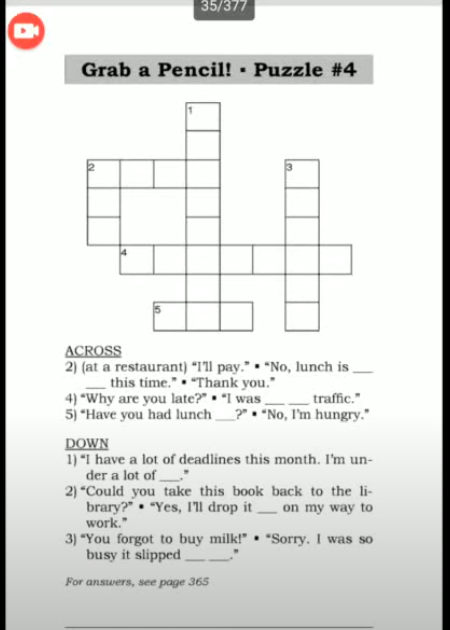
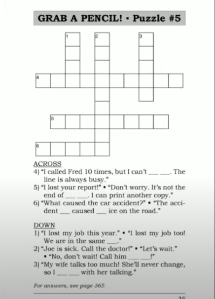
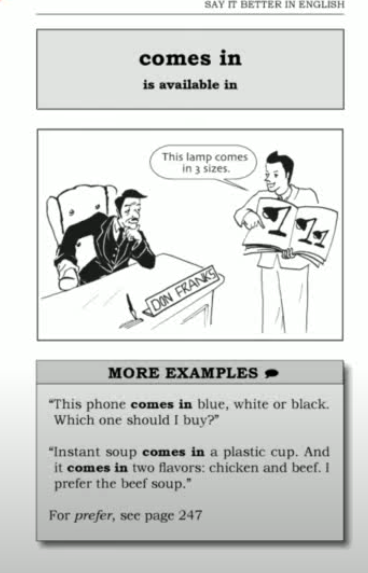

# Say It Better 

> [ Say It Better 2 ](https://www.youtube.com/watch?v=-iUCCxveJyk&list=PLjGyCF-b63jgheXXlZhfBIb2W65vktvOf&index=4)

| No | Form | Word                | Meaning                | Example                |Reference                |
|---------------------|---------------------|---------------------|---------------------|---------------------|---------------------|
|1||on me |ငါရှင်းလိုက်မယ်|eg. <br> 1) It's on me. You paid last time. <br> 2) <br> A. Lunch is on me today. <br> B. Thanks Jack. <br> A. It's my pleasure. <br> 3) <br> A. Let's split the check. <br> B. No, the drinks are on me today.||
|2||stuck in traffic|ကားလမ်းတွေပိတ်နေတာ|eg. <br> 1) Sue, I'll be home late. I'm stuck in traffic. <br> 2). Sorry, I'm late. I was stuck in traffic for an hour. <br> 3). There's no point in driving downtown during rush hour. You'll be stuck in traffic||
|3||it slipped my mind|Forgot မေ့သွားတယ်|eg. <br> 1) <br> A: Dad, you forgot my birthday party. <br> B: I'm sorry Tommy. It slipped my mind. <br> 2) <br> A: Did you mail my letter? <br> B: Oh, it slipped my mind. I'll do it tomorrow. <br> 3) I was supposed to meet Fred last night, but I forgot. It slipped my mind .||
|4||under a lot of pressure|Stress ပိနေတယ် ( Feeling stress)|eg. <br> 1) We are under a lot of pressure because we have to finish this job by Friday. <br> 2) Students are under a lot pressure at exam time.||
|5|by -- |by 5pm|နောက်ဆုံးထားပြီတော့|eg I need it by 5pm||
|6|drop [ something ] off||ချခဲ့တာ . ချပေးခဲ့တယ် |eg. <br> 1) Could you drop this off at the shoe repair shop? <br> 2) I'm going to the dry cleaners. I want to drop off some shirts. <br> 3) <br> A: Don't Stay and talk. Just drop off the gift and leave .<br> B: Okay, I'll just drop it off ||
|7||pick up|အောက်ကျလို့ကောက်တာ . လာကြိုတာ|eg. <br> 1) He pick me up in the evening||
|8|Have you done [ something ] yet?||တခုခုလုပ်ပြီးပြီလား|eg. <br> 1) <br> A: Have you called the plumber yet? <br> B: No, not yet. It's only 8 o'clock. <br> 2) <br> A: have you eaten lunch yet? <br> B: Yes, I had lunch an hour ago. <br> 3) <br> A: Have you been to the post office yet? <br> B: No, not yet, I'm going now.||
|8||get through|make contact with someone by phone.<br> ဖုန်းနဲ့ ဆက်သွယ်လို့ရတာ|eg. <br> 1) I can't get through. <br> 2) <br> A: I tried to call you, but I couldn't get through. <br> B: Sorry, I turned off my cell phone. <br> 3) Don't call the bank at lunchtime. They are so busy. It's difficult to get through||
|9||turn off / turn on|စက်ပစည်း ပိတ်တာ ဖွင့်တာမှာသုံးတယ် (not use "open")|||
|10||take everything apart/take it apart|တစစီဆွဲဖြုတ်တာ|||
|11|put up with [ something ] ||သီးခံနေရတာ|eg. <br> 1) The plumber is coming to fix it tomorrow so I have to put up with it today. <br> 2) You neighbors's dog is so noisy! How can you put up with the noise? <br> 3) My office is freezing, but i put up with it because i love my job||
|12||loads of lessons|အိမ်စာတွေအများကြိးပေးတာ|eg. <br> 1) I had loads of lessons today.<br> 2) I learned loads of lessons from that experience.||
|13||right away|ချက်ချင်း|eg. <br> 1) Hello, Plumber? This is an emergency! We need you to come right away.<br> 2) <br> A: Waiter! I ordered soup 30 minutes ago ! <br> B: I'm sorry, Sir. I'll bring it right away. <br> 3) <br> A: The client is waiting. He needs the report. <br> B: I'll get it right away. ||
|14| x caused y / y was caused by x|||eg. <br> 1) <br> A: Maybe a broken pipe caused the problem. <br> B: That's right. The problem was caused by a broken pipe. <br> 2) <br> A:What caused the delay? <br> B:Heavy rain caused the delay. <br> 3) <br> A: The good are damaged! <br> B: The damage was caused by the shipping department. ||
|15||It's not the end of the world|this situation is not very bad|eg. <br> 1) It's not the end of the world. Your hair will grow back. <br> 2) I hurt my knee, but it's not the end of the world. I can still play golf. <br> 3) <br> A: I failed my driving test. <br> B: It's not the end of the world. You can take the test again.||
|16||in the same boat|တခုခုကို ကိုယ်ချင်းစာတဲ့အနေနဲ့သုံးတာ. နင်လည်း ဒီလို ပဲ ငါလည်း ဒီလိုပဲဆိုတာမျိုး ( in the same bad situation )|eg. <br> 1) <br> A:My husband is often away on business. <br> B: So is mine ! We're in the same boat. <br> 2) We all lost money last year. We're in the same boat.||
|17||I'm not following you|ရှင်းပြနေတယ် မမှီတော့ဘူး မလိုက်နိင်တော့ဘူး ဆိုတဲ့ အခြေအနေမှာသုံးတယ်|eg. <br> 1) <br> A: To save the document, click on "copy" then open a new file and click ... <br> B: I'm not following you. Click on what? <br> 2) <br> A: He's not unfriendly, he's just not friendly. <br> B:I'm not following you. <br> ||
|18||get cut off|လိုင်းပြတ်သွားတာ|eg. <br> 1) We got cut off. <br> 2) There's something wrong with my phone. I often get cut off. <br> 3) <br> A: Hello ? <br> B: Hi. This is John again. We got cut off just now, so I'm calling you back. <br> ||
|19||have change|အကြွေရှိသလား|eg. <br> 1) <br> A: Do you have change for $10? <br> B: Yes, here are nine ones and some small change.<br> 2) <br> A: Your coffee is $3. please.<br> B:Here's a 50 dollar bill. <br> A: Sorry. I don't have change for a fifty. <br> ||
|20|[distance] from a place||တနေရာနဲ့တနေရာ ကွာတာ ကိပြောတာ|eg. <br> 1) <br> A: Mr. Franks, I can't find your office. <br> B: My office is 3 blocks from the train station. <br> 2) <br> A: Where's Palo Alto<br> B: It's ablout 30 miles from San Francisco. <br> 3) Our office is about 200 feet from Grand Central Station  ||
|21||the second to last|နောက်မရောက်ခင်တခု. ဟိုးနောက်ဆုံးကရေရင် ဒုတိယ တခု|eg. <br> 1) We went to France for a week. We were having a great time. But on the secont to last day, I got sick. <br> 2) <br> A:Which is your house? <br> B: The secont to last house on the street.<br> ||
|22||comes in|အတွဲလိုက်ရတာမျိုးကို ဆို comes ins နဲ့ သုံးပါတယ် ( is available in )|eg.<br> 1) This lamp comes in 3 size. <br> 2) This phone comes in blue, white or black. Which one should I buy ? <br> 3) Instant soup comes in a plastic cup. And it comes in two flavors: chicken and beef . I prefer the beef soup.||
|||||||
|||||||
|||||||
|||||||
|||||||
|||||||


## Tips to become proficient in English 
#### Basic Facts
[Reference Link](https://www.youtube.com/watch?v=DIBCF8WQnjU&list=PLjGyCF-b63jgheXXlZhfBIb2W65vktvOf&index=3)

An + Vowel Sound အ အသံ ( သရ​ )  
a, i , u , e , o => Vowel Letter 

A + Consonant Sound ( ဗျည်း )

An Arrow  
An Eraser  
An hour  
A Honest man   x => An Honest man
A University  
An Umbrella  

## Note 

> ✅　drop something off, drop of something , drop it off  
> ❌ drop off it  
> Pluber ပိုက်ပြင်တဲ့ သူ  
> There's something wrong with ~ → 「～に何か問題がある／調子が悪い」という意味の定番表現。
```
There's something wrong with my computer.
　→ パソコンの調子が何かおかしい。

There's something wrong with this soup. It tastes weird.
　→ このスープ、何か変だ。変な味がする。

There's something wrong with the printer. It won’t print.
　→ プリンターがおかしい。印刷できない。

There's something wrong with her attitude lately.
　→ 彼女の態度、最近なんか変だよ。

There's something wrong with my car engine.
　→ 車のエンジンに何か問題があるみたい。

I think something’s wrong with the air conditioner.
　→ エアコン、なんかおかしい気がする。

Is there something wrong with the Wi-Fi?
　→ Wi-Fi、調子悪くない？
```

>There’s no point ～ ＝「～しても意味がない」「～しても無駄だ」
```
There’s no point in arguing.
　→ 言い争っても意味がないよ。

There’s no point in trying again.
　→ もう一度やっても無駄だよ。

There’s no point in crying over spilled milk.
　→ 起きたことを悔やんでも仕方がない（ことわざ）。
```

> small change = coins; bill = paper money;   
> Here you are ဒီမှာပါ  
> My house is about 5-minutes walk from the bus stop .  
> My house is 10-minutes drive from my work.  


## Puzzle




1) <br> A: <br> B: <br> 