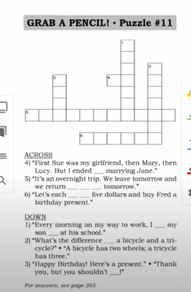
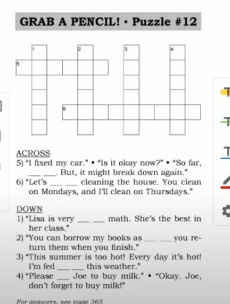
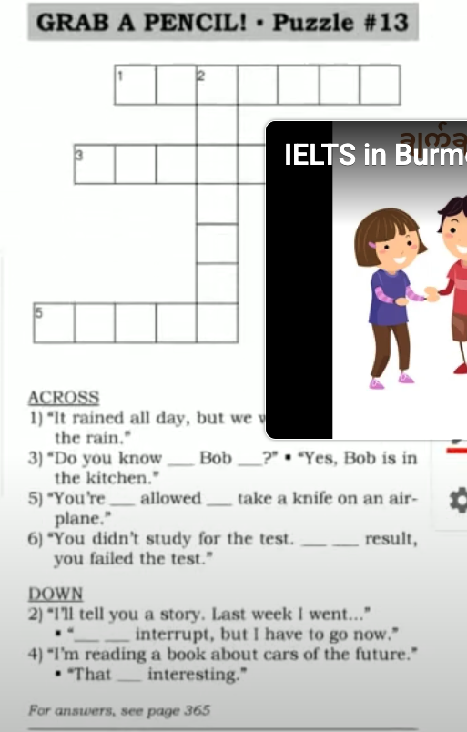

# Say It Better 

> [ Say It Better 4 ](https://www.youtube.com/watch?v=IDhmdfgE0ns&list=PLjGyCF-b63jgheXXlZhfBIb2W65vktvOf&index=9)  
  
| No | Form | Word                | Meaning                | Example                |Reference                |
|---------------------|---------------------|---------------------|---------------------|---------------------|---------------------|
|1||chip in|တယောက်ကို ညီတူညီမျှ အချိုးကျ ပိုက်ဆံထည့်တာ . ငွေထည့်တဲ့သဘောမျိုးမှာလည်းသုံးတယ်(တတ်နိုင်သလောက်ထည့်) contribute money|eg.   1) It's Mr.Lee's birthday soon. Let's each chip in $20 and buy a gift.   2) Every Summer, my friends and I chip in $100 each to rent a boat.   3) My older brothers and sisters chipped in to pay for my education.|
|2|drop [someone] off||ချပေးခဲ့တာ|eg.   1)   A: I'm going to West Mall.   B: Come On. I'll drop you off.   2)   A: Could you drop me off at the bank?   B: Sure, I'm going to drive right past the bank.   3)   A: Why are you late?   B: I dropped Sharon off at her house. Her house broke down.    4) Bye. Thanks for dropping me off. ||
|3|What's the difference between A and B|||eg.   1)   A: What's the difference between this tie and that tie?   B: This one is made of silk. That one is made of cotton.   2)   A: What's the difference between the words 'large' and 'big'   B: There's no difference.   3)   A: What's the difference between these two cell phones.   B: One has a digital camera and the other one doesn't. ||
|4|end up v-ing something|end up doing something|နောက်ဆုံးတော့ဒါကိုလုပ်လိုက်တယ်|eg.   1) I looked at lots of things but I ended up buying this watch.   2) Tim was a bad student. How did he end up becoming a doctor?   3) At first business was good. But our costs were very high. So, we ended up losing money.||
|5|you shouldn't have||တယောက်၂ က ကိုယ့်ကိုယ် လုပ်ပေးတဲ့အခါ အားနာတဲ့အနေနဲ့ပြောတာ|eg.   1)   A: You shouldn't have!   B: It's our pleasure.   2)   A: I bought you this gift.   B: Thank you, but you shouldn't have.   A: It's nothing really.   3)   A: Happy Anniversary!  B: A gift for me? You shouldn't have!   A: My pleasure.  ||
|6||the day after tomorrow|သန်ဘက်ခါ|eg.   1)   A: How long are you going away for?   B: 2 nights. We will be back the day after tomorrow.   2)   A: I'm getting married in three days!  B: So the day after tomorrow is your last day as a single man   3) Tomorrow is July 3rd, so the day after tomorrow is July 4th. |
|7|take turns v-ing something|take turns doing something|တလှည့်စီလုပ်တာကိုပြောတာ|eg.   1) It's a long way. Let's take turns driving.   2) My parnter and I take turns opening the shop.   3) Last year, my husband and I both worked, so we took turns cooking dinner.||
|8|remind [someone] to|remind me to|သတိပေးနော်|eg.   1) When we get to the hotel, remind me to call my mother.   2) Could you remind Sharon to order more envelopes? I think she forgot.   3) When we get to the grocery store, please remind me to buy some eggs.||
|9|fed up with [something]||စိတ်ပျက်တာစိတ်ကုန်တာ|eg.   1) They're building a new house on my street. Every day they hammer and saw and drill! I'm fed up with all the noise.   2) I don't like my job. I'm fed up with paper-work.   3) I'm fed up with the rain.||
|10|as long as||တခုခုလုပ်နေသရွေ့|eg.   1)   A: Dad, can i go with you?   B: You can come as long as you wear this.   2) We play football every sunday morning as long as it's not raining.   3)   A: Boss, I'd like to leave at 4 o'clock today.   B: That's fine as long as you finish the report first.   ||
|11|good at [something]|||eg.   1) He's good at fishing.   2) My father is very good at golf, but my mother isn't.   3) Could you give me a hand with this letter? I'm not very good at writing in English. |NOTE: sometimes good at + v-ing |
|12|bad at [something]|||||
|13|so far, so good||အခုထိတော့အခြေအနေကောင်းတယ်ဆိုတာမှာ သုံးချင်တာ|eg.   1)   A: How's your sandcastle coming along.   B: so far, so good.   2)   A: You fixed the printer again! How's it working?   B: So far, so good. I hope it doesn't break again.   3)   A: How's your new job?   B: I've only worked three for three days but so far , so good.   ||
|14||that sounds|ကြားရတာဒီလိုပေါ့|eg.   1)   A: They have grilled fish in a lemon sauce. That's sounds delicious   B: That's sounds disgusting   2)   A: We stayed in a five-star hotel right on the beach.   B: That sounds beautiful.   3)   A: I'm going to climb up on the roof and fix the leak.   B: That sounds dangerous!   ||
|15|you're not allowed to do something||ဒါလုပ်ခွင့်မရှိဘူး|eg.   1) Dad, you're not allowed to park here.   2) I read that you're not allowed to chew gum in singapore.   3) I can't work in the USA because I don't have a work permit. You're not allowed work without a permit.||
|16|despite [ something ]||eventhough, although, inspite of |eg.   1)   A: How was your trip?   B: We had a good time despite the rain.   2) The company did well this year despite poor sales in March.   3) He goes jogging every day despite having a borken arm. |NOTE: sometimes despite + -ing |
|17||as a result|တခုခု လုပ်တဲ့အတွက် အကျိုးသက်ရောက်မှုကတော့ ဒါဖြစ်တယ်ပေါ့|eg.   1)   A: I forgot to close it.   B: Well, as a result, everything fell out!   2) My brother left school when he was 14. As a result, he can't find a good job.   3) It rained a lot last year. As a result, we sold a lot of umbrellas.||
|18||Do you know where [ Mr. Smith] is?||eg.   1)   A: Do you know where Ohio is?   B: I think it's near Pennsylvania.   2)   A: Terri, do you know where the July Bank statement is?   B: I have no idea.   ||
|19||sorry to interrupt|ဖြတ်ပြောရတာ အားနာပါတယ်|eg.   1) Sorry to interrupt, but Mr. Marco wants to see you right now.   2)   A: Tuesday is a holiday so...   B: Sorry to interrupt, but Wednesday is a holiday, not Tuesday.   A: Oh, yes. You're right.   ||
|||||||
|||||||
|||||||
|||||||

## NOTE

Revision 

> We have been studying together for 2 / a couple of weeks.    
> Have you already made up your mind to study English?   
> We started doing this program two / a couple of weeks ago.  
> We'll discuss it.   
> I stayed up late.  
> I overslept this morning.  
> A win-win situation.  
> That's it.
> Can I take a raincheck?  
> On top of that.

> It has sentimental value    
  ငွေရေးကြေးရေးအရတော့သိပ်တန်ဖို့းမရှိပါဘူး ဒါပေမယ့် အမှတ်တရအနေနဲ့ပေးတာပါပေါ့  
> the day after yesterday တနေ့က  
> the other day နောက်တရက်ရက်ပေါ့ ( future . past can also use )  
> as long as ဒါလုပ်နေသရွေ့ ရတယ် on the conidition that  
> give me a hand ကူညီပါဦး။။    
> How's [ something ] coming along ? အခြေအေနေဘယ်လိုလဲ လို့မေးတာ   
> fix the leak ( leak ယိုစိမ့်နေတာ ယိုပေါက် )  
> despite Noun phrase ပဲလိုက်   
> although ဆိုရင် Sentence လိုက်တယ်  
> can i talk to you for a moment? ခဏလောက်စကားပြောလို့ရမလား

## Puzzle
  
  
  

## LISTENING 

(Refernece Link)[https://learnenglish.britishcouncil.org/skills/listening/a1-listening]