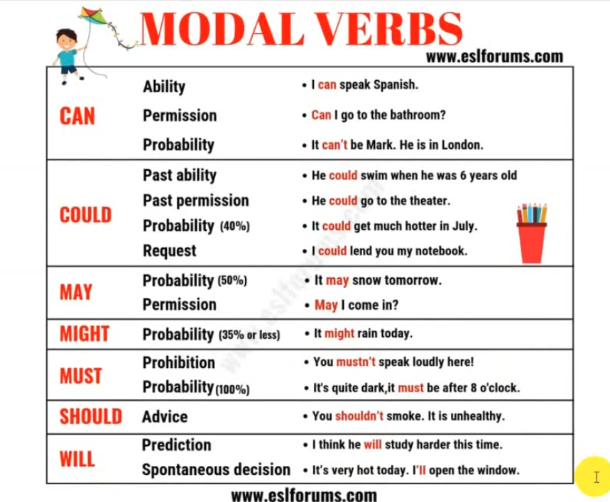
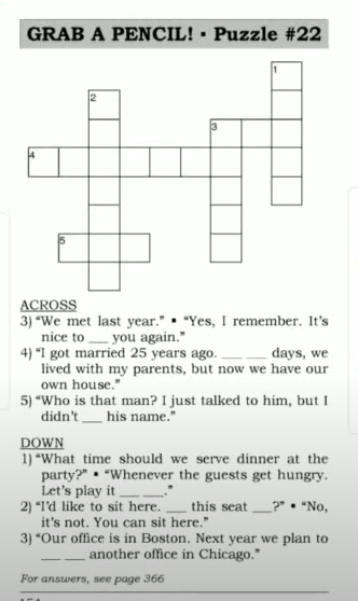
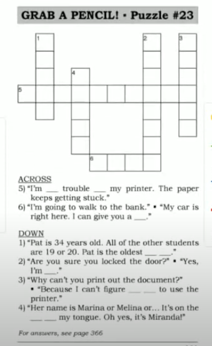
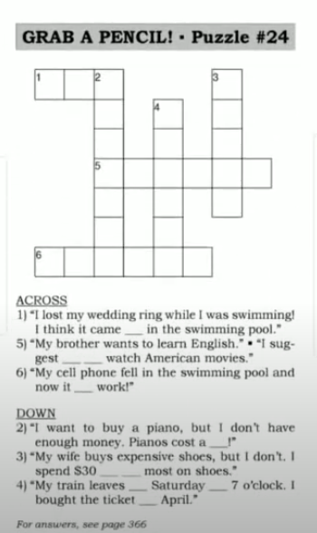
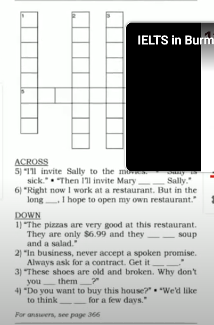

# Say It Better 

> [ Say It Better 7 ](https://www.youtube.com/watch?v=ybPn6rUq1hM&list=PLjGyCF-b63jgheXXlZhfBIb2W65vktvOf&index=10) 

| No | Form | Word                | Meaning                | Example                |Reference                |
|---------------------|---------------------|---------------------|---------------------|---------------------|---------------------|
|1||Is this seat taken?|ဒီနေရာမှာ လူရှိသလား   ထိုင်လို့ရသလား   This is polite to ask before siting beside a stranger.|eg.   1)   A: Is this seat taken?   B: Yes, Someone's sitting here. Sorry.   2)   A: Excuse me. Is this seat taken?   B: No, go ahead.  3)   A: Is this seat taken?   B: Yes, sorry. I'm saving it for someone.    ||
|2||play it by ear|မီးစင်ကြည့်ကတယ်   do it without a plan   improvise   ကြည့်ကြပ်လုပ်ကတော့မှာပဲ|eg.   1) I didn't prepare a speech so I don't know what I will say. I'm going to play it by ear.   2)   A: What movie should we see?   B: Let's play it by ear. Let's go to the movie theater first, and then choose a movie.   3) Don't book a hotel room. Play it by ear. Look for a hotel when you get to the city.||
|3||set up|establish; start|eg.   1) I started the business in 1974. I set up a bank account, I set up an office and I set up a filiming system.   2) I work for a company, but next year I hope to set up my own business.   I'm a computer programmer. I set up accounting system for companies.||
|4|<b> in those days / today </b>||အဲ့ဒီတုန်းကတော့ / အခုချိန် ကနေ့   then / now |eg.   1) I started in 1974. In those days, the business was small. But today, we have a staff of 50!   2) I became a writer in the 1970's. In those days I used a typewriter, but today I use a computer .   3) I went to Tate College. In those days I had no money. Today I own a beautiful home.||
|5|<b> I didn't get </b> your <b> name </b>||ဘာပြောလိုက်တာလဲ ဟင် မသိလိုက်လို့   Say this when you didn't hear someone's name, or you can't remember it.|eg.   1)   A: Maria, this is Bob Beckham, Jenny Jones and Tom Smith   B: I didn't get your name.   2) Who's that man in the blue jacket? I didn't get his name.   3)   A: This is Mr.Stevanoloulich.   B: Mr....? Sorry, I didn't get your name.  ||
|6||nice to see you again|Say this when you see someone who you don't see often   NOT ~~Nice to meet you~~|eg.   1)   A: Ann, do you remember Bill Evans from Eastern Lighting?   B: Oh, yes. Hello Bill.   C: Nice to see you again Ann.   2)   A: Hi Ann. I haven't seen you for a long time.   B: Yes, nice to see you again, Ahmed.   3) Good-bye Jim. It was nice to see you again. Please send my regards to your wife. |Please send my regards to your wife - သတိရကြောင်း ပြောပေးပါ|
|7||it's on the tip of my tongue|I can almost remember it   ပါးစပ်ဖျားလေးမှာတင်မေ့နေတာ |eg.   1)   A: I can't remember his name.   B: It's on the tip of my tongue. Mr. Ber...Bergman? Bernman? Berman?   2)   A: What's the capital of Canada?   B: Otta....It's on the tip of my tongue. Otta.... Ottawa!   3)   A: Do you remember my address ?   B: Sure, it's 22 ...wait, it's on the tip of my tongue .... Elm Stree?   A: Yes, that's right!   ||
|8|<b> give </b> someone <b> a ride </b> ||လမ်းကြုံခေါ်သွားပေးမယ်   drive someone to a place they need to go|eg.   1)   A: Jenny, come on. I'll give you a ride home.   B: Great! Thanks.   2)   A: Could you give me a ride to school ?   B: Sure, I'll drop you off on my way to work.   3)   A: How are you getting to the party?   B: Mary is giving me a ride.   |How are you getting to - ဘယ်လိုသွားမှာ လဲ​|
|9|<b> have trouble with </b> something||ပြဿနာတက်တာ   ပြဿနာရှိတယ်   အဆင်မပြေတာတွေမှာလည်း သုံးတယ်   Say this when something is a problem|eg.   1) I'm having trouble with my car.   2) My son is having trouble with his chemistry homework. Can you help him?   3) I always have trouble with this key! It's difficult to unlock the door!||
|10|<b> by far</b>||by a large amount  အပြတ်အသတ်ကွာတာ|eg.   1) This was our best year by far.   2) This is the fastest printer we have by far. All the others are much slower.   3) Most camera shops charge 50 cents per photo. But this shop charges only 20 cents! That's the lowest price by far.||
|11|<b> I'm positive</b>||I'm 100% sure.|eg.   1)   A: I can't find the key.   B: Are you sure you left it on the table ?   A: I'm positive. I remember putting it there.   2)   A: Mr. Jackson still hasn't received my letter.   B: Are you sure you sent it?   A: I'm not positive. but I think so.   3)   A: There's a mouse in the corner.   B: Are you sure ?   A: I'm positive.  ||
|12|<b> I can't figure out how to </b>||ဘယ်လိုလုပ်ရမလဲ မသိဘူး   Say this when you can't understand how to do something|eg.   1) I can't figure how to use this.   2)   A: I can't figure out how to turn this radio on.   B: Just press this button.   3) Joe can't figure out how to use the fax machine. Could you give him a hand?||
|13|something <b> works / doesn't work </b>||အလုပ်ဖြစ်တယ် အလုပ်မဖြစ်ဘူး|eg.   1) It doesn't work.   2) OOOUCH! It works!   3)   A: This radio is so old. Does it work?   B: Yes, it works well. Just plut it in.   3) My camera doesn't work. I dropped it yesterday. I must have broken it. |plug it in|
|14|<b> suggest that he / you / we </b>|suggest + <subject form>   NOT ~~suggest him to~~ NOT ~~suggest you to~~ NOT ~~suggest us to~~|အကြံ ပြုချင်တယ်|eg.   1)   A: I suggest that you sit down.   B: I suggest that he put ice on it.   C: I suggest that we call the doctor.   2)   A: I need a lot of money.   B: I suggest that you go to your bank. They can lend you money.   3) His hair is too long, so I suggested that he get a haircut. |NOTE suggest that he put, get, go, etc. NOTE ~~suggest that he puts, gets, goes, etc~~|
|15|<b> in + month; on + day; at + time|<b> in </b> May / <b> on </b> Tuesday,   May 2 <b> at </b> 9 o'clock  month , season, year တို့ဆို in နဲ့ သုံးတယ်||eg.   1) The doctor is very busy. He can see you on Tuesday, May 2nd at 9 o'clock.   2)   A: When did she have the baby?   B: It was in July. In fact, it was on Jly 16 at 6 o'clock   3)   A: Are you free next Wednesday?   B: No, but I'm free on Thursday.   A: How about at 3 o'clock.|NOTE NOT ~~on next Wednesday~~   in the morning, in the afternoon, at night, at christmax, on weekend , at weekend(bristish)|
|16|<b> come off</b> ||ပြုတ်ထွက်လာတာ   ကွာကျလာတယ်   become detached |eg.   1) Tom, look! The bumper is coming off!   2) I bought a cheap suitcase. The wheels came off after one week!   3) My house is in bad condition. The paint is coming off the walls. And last night, the door handle came off the door.||
|17|<b> a fortune </b>||a lot of money   ပိုက်ဆံတွေအများကြီး|eg.   1)   A: Why can't we buy one of these cars?   B: Because they cost a fortune.   2) Last summer it rained every day. Umbrella companies made a fortune!   3) He spends a fortune on his son's education. It isn't worth it. His son never students.|NOTE: made = earned|
|18|<b> at the most </b>||အများဆုံး   not more than |eg.   1) That's too expensive for me. I can spend $7,000 at the most.   2) The wedding hall is small, so we can invite 30 people at the most to our wedding.   3) I can play tennis for one hour at the most, After an hour, I feel tried. |at the least အနဲဆုံး|
|19|<b> in the short term / in the long run </b> ||ရေတိုမှာ / ရေရှည်မှာ   temporarily / over a long period of time|eg.   1) If we buy this car, we will save money in the short term.But we will lose money in the long run.   2) Covering the hole in your roof is okay in the short term. But in the long run, you will need a new roof.   3) Smoking doesn't always hurt you when you're young. But in the long run, you develop health problems.   ||
|20|<b> think it over</b>||စဉ်းစားလိုက်ဦးမယ်   take time to think before deciding|eg.   1) I want to think it over.   2)   A: Will you take that job?   B: I'm not sure. I need a few days to think it over.   3) I've thought it over and I've made up my mind. I'm going to study engineering.   ||
|21|<b> get </b> something <b> in writing </b> ||စာရေးထားတဲ့ အထောက်အထားလေးနဲ့ရမလား   နှုတ်ကတိနဲ့တင်မဟုတ်ဘဲ စာရေးပေးပါ   have a signed agreement or contract|eg.   1)   A: If the car has a problem, I will repair it.   B: Can I get that in writing   2)   A: He said he will pay me next month.   B: You should get it in writing.   3)   A: You and I already have a verbal agreement.   B: Yes, but I'd like to get our agreement in writing.   |NOTE : verbal agreement = a spoken agreement|
|22|<b> come with </b>||တွဲပြီးလာတာ   တွဲပါပြီးသားလား   be served with and included in the price of something|eg.   1)   A: What does the burger come with?   B: French Fries and a small cola.   2) You don't need to order soup because your chicken comes with soup .   3)   A: Does the spaghetti come with a salad?   B: No, a salad costs extra.   ||
|23|<b> instead of </b> something||အစား   to replace something|eg.   1) Could I have coffee instead of a cola.   2) We have a meeting on Friday, but I'll be very busy then. Could we meet on Thursday instead of Friday.   3) My Fax machine is broken. Please email me instead of faxing me.|NOTE: sometimes instead of + v-ing|
|24|<b> throw </b> something <b> away </b>   <b> put </b> something <b> away </b> ||လွှင့်ပစ်တာ / သိမ်းတာ   put someting in the trash / put something in a special storage place |eg.   1)   A: Can I throw this box away ?   B: No, Please put it away. I might need it.   2) Those carrots are two months old. Throw them away!   3) My kids always put away their toys when they're finished playing.   |NOTE: throw something away, throw away something, throw it away, NOT ~~throw away it~~   NOTE: put something away, put away something, put it away, NOT ~~put away it~~|
|||||||
|||||||
|||||||

## NOTE

> Send my regards
> suggest + base form ဆို သူများကို အကြံပြုတာ ကိုပါ၀င်လုပ်တာ suggesting
#### Revision 

## MODAL VERBS 
spontaneous ချက်ချင်း 
modal verbs + infinitive v1
Should 
 You should try hard. သေချာကြိုးစားသင့် အခု ---- →
 You should have tried hard အတိတ်က လုပ်ခဲ့သင့်တာပေါ့

## Puzzle

