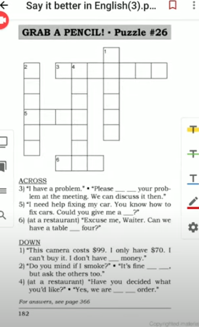
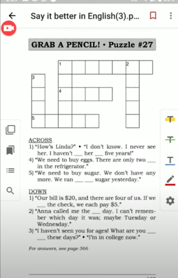
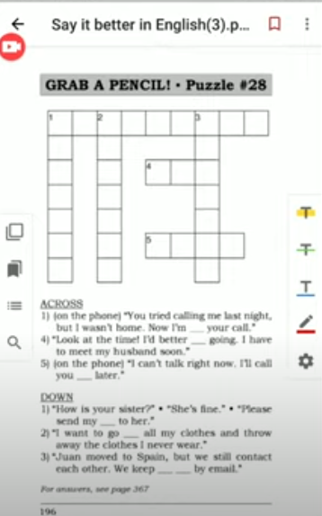
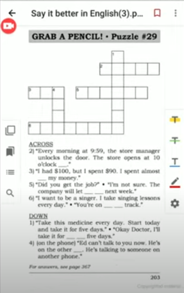
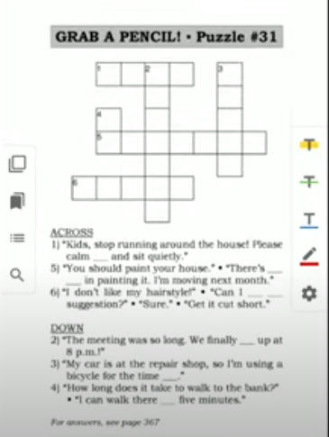

# Say It Better 

> [ Say It Better 9 ](https://www.youtube.com/watch?v=FyOOzAYHm_Y&list=PLjGyCF-b63jgheXXlZhfBIb2W65vktvOf&index=13)  
> [Others](https://www.youtube.com/watch?v=EfBm-NnTN2s&list=PLjGyCF-b63jgheXXlZhfBIb2W65vktvOf&index=12)

| No | Form | Word                | Meaning                | Example                |Reference                |
|---------------------|---------------------|---------------------|---------------------|---------------------|---------------------|
|1|<b> give </b> someone <b> a hand </b> || ဒါလေးတခုလောက် ကူညီပေးပါလား   help someone| eg.   1) Bob, could you give me a hand with the door.   2)   A: I can't reach the top shelf.    B: Let me give you a hand.   3) Fred had to photocopy 1,000 pages, so I gave him a hand with the job.||
|2|adjective + enough / enough + noun|<b> enough </b> | | eg.   1)   A: Are you tall enough ?    B: Yes, but there's not enough space   2) I don't have enough time to call him today. I'm too busy.   3)   A: Can you print 100 pages an hour?   B: No, my printer isn't fast enough. | Note : NOT ~~enough tall~~ / NOT ~~space enough~~   NOTE: nount = thing ( eg. book, house) ; adjective = describing word ( eg. good, tall)|
|3|<b> bring </b> something <b> up</b>||တခုခုကိုပြောကြားတာမျိုး ထုတ်ပြောတာမျိုး    start talking about something|eg.   1)   A: This storage room is too small!   B: Why don't you bring it up at the meeting   2) Sam brought up the problem and then we all discussed it.   3)   A: Can we talk about the schedule?    B: Yes, I'm glad you brought it up.   |NOTE: bring something up, bring up something, bring it up   NOT ~~bring up it~~|
|4||fine with me |ကျနော်ကတော့ အဆင်ပြေပါတယ် ကျမကတော့ အဆင်ပြေပါတယ်   I accept the suggestoin|eg. 1)   A: How about eating here ?   B: It's fine with me .   C: Fine with me too.   2)   A: Why don't we paint this wall green?   B: Okay. That's fine with me .  3)   A: Would it be possible to change the meeting to Thursday?   B: That's fine with me, but you'd better ask Frank too.   |Would it be possible to …することは可能でしょうか？|
|5||<b> a table for </b> three|3ယောက်စားမှာ ၃ ယောက်စာမယ့် ခုံပေးပါ|eg.   1)   A: A table for 3, please.   B: I'll be with you in a minute.   2) We'd like a table for two in non-smoking, please.   3) Could we have a table for four by the window, please? ||
|6||<b> ready to order </b> ||eg.   1) We're ready to order   2)   A: Miss? We're ready to order.   B: I'll be with you in one moment.  3)   A: Excuse me, I'm ready to order.   B: Okay. What would you like ?  ||
|7||<b> split the check </b> |each person pays the same amount at a restaurant   အချိုး ကျစီ ခွဲပြီးရှင်းတာ |eg.   1) Let's split the check. It's $30.   2)   A: Who paid for dinner?   B: We each paid $20. We split the check.   3)   A: This dinner is on me.   B: No, you paid last time .Let me pay.   A: The bill is $150. I can't let you pay that much!   B: Okay, then let's split the check.   ||
|8||the other day |a few days ago   တနေ့ကလေ ဟိုးနေ့က |eg.   1)   A: Have you tried that new restaurant?   B: Yes, I went there the other day.   2) I had a car accident the other day when I was driving to work.   3)   A: I saw Mr.White the other day.   B: When ?   A: I can't remember.   ||
|9||<b> there is </b> something <b> left</b> |something is remaining   ဘယ်လောက်ကျန်တယ်ဆိုတာမှာသုံးတာပါ|eg.   1) There's only one left.   2)   A: Is there any pizza left?   B: Yes, there are two slices left.   3) We ran out of paper yesterday. There's no paper left.   ||
|10||<b> run out of </b> something|use something until it is finished |eg.   1) We've run out of teabags.   2)   A: Where are the stamps?   B: We ran out of them. I used the last one yesterday.   3) We're running out of envelopes. We only have three left.   |NOTE: running out of = almost finished |
|11||<b> I haven't seen </b> you <b> for </b> years |the last time I saw you was many years ago   မတွေ့ ရတာတောင်ကြာပြီ |eg.   1) Bob? Bob Beckham! I haven't seen you for years!   2) I miss my family. I haven't seen them for six months.   3) Is Tom in the office this week ? I haven't seen him for a few days. ||
|12||What are you up to these days.|ဘာတွေလုပ်နေလဲ   tell me about your recent life |eg. 1)   A: What are you up to these days?   B: Well, I'm a teacher now. I teach history at a high school. I just bought a house and ....   2)   A: What are you up to these days?    B: I have my own company now.   3)   A: I haven't seen you for ages. What are you up to these days?   B: I'm still working for the same company.   |NOTE: ages = a long time|
|13||I'd better get going ( I had ..)|သွားမှဖြစ်တော့မယ်   သွားတော့မယ်   Say this when you need to leave .|eg.   1) I'd better get going. I have a meeting now.   2) It's late. I'd better get going. But thank you for a very nice dinner.   3)   A: Would you like another coffee?   B: Actually. I'd better get going now.   ||
|14||keep in touch |continue to have contact |eg.   1)   A: Nice to see you again Diane. Here's my card. Keep in touch.   B: Okay, I'll call you sometime.   2) My brother lives in Italy. We keep in touch by phone.   3)   A: Do you keep in touch with your old classmates?   B: Yes, we email each other.  ||
|15||<b> send my regards to </b> someone|နှုတ်ဆက်တယ်လို့ပြောလိုက်ပါဦး|eg.   1)   A: Please send my regards to your mother.   B: I saw Bob Beckham today. He sends his regards to you.   2)   A: How's your family?   B: Fine thanks.   A: "Sends my regards to them"   3)   A: Andy sends his regards to you.   B: Please send my regards back to him.    ||
|16||<b> call </b> someone <b> back </b> |ပြန်ခေါ်မယ်နော်|eg.   1) Mom, I can't talk right now. I'll call you back in a few minutes.   2)   A: Mr.Smith called you.   B: I know. I tried to call him back, but he wasn't in the office.   3) I don't have the information you need. I'll find it and call you right back. |NOTE: call someone right back = call someone back very soon |
|17||<b> go through </b> something|တခုခုကိုစေ့စေ့စပ်စပ်ရှာဖွေနေတာ|eg.   1)   A: Could you go through these files and find Mrs.Hugo's phone number?   B: Ahh, Here it is!   2) I went through my bag, but I still can't find my keys.   3) I'm going through this report. I want to double-check for mistakes.   ||
|18||<b> returning </b> someone <b> call </b>|ပြန်ခေါ်တာ|eg.   1)   A: Hi Mary, I'm returning your call   B: Thank Louis. I called you yesterday because ...  2)   A: May I speak to Don?   B: Can I ask what is regarding?   A: Yes, I'm returning his call.  |Can I ask what is regarding - ဘာကိစလို့ပြောလိုက်ရပါမလဲ |
|19||on the other line|ဖုန်းမအားသေးဘူး နောက်တခြား တလုံးနဲ့ပြောနေတယ်​  talking on a different phone line|eg.   1)   A: May I speak to Mr. Beckham?   B: I'm sorry, Mr. Beckham is on the other line right now.   2) When you called me, I was on the other line, so I couldn't talk to you.   3)   A: Can I speak to Ivan.   B: He's on the other line. Would you like to leave a message   ||
|20||on the right track|လုပ်နေတာမှန်တာ   doing the right thing|eg.   1)   A: Dad, am I doing this right?   B: Yes, Son. You're on the right track   2) We haven't succeeded yet, but we're on the right track.   3)   A: I want to get a better job, so I'm going to business school   B: You're on the right track.    ||
|21||<b> almost all </b> something|အားလုံးနီးပါး   90% of somethng|eg.   1) You ate almost all the cake! And almost all the cookies.   2) I'll be in the office almost all day. I'll just go out for lunch.   3) Ernest Hermingway is my favorite writer. I've read almoist hist|NOT: ~~almost the cake ~~|
|22||<b> for the next </b> four days |နောက်ထပ် ၄ ရက်   starting now and continuing for four days.|eg.   1) Today is Monday. Your test is Friday. You must study hard for the next 4 days!   2) We are fixing the elevator. For the next few hours , please use the stairs.   3) Sam is on leave. For the next three weeks, Mary wil be doing this job.|on leave : ခွင့်ယူထားတာ  |
|23||<b> at </b> three o'clock <b> sharp </b>|တိတိ |eg.   1)   A: What time does the test start?   B: At 3 sharp.   2) The meeting will start at 4 o'clock sharp, so please be on time.   3) The boat leaves at 7:59 a.m sharp. So if you arrive at 8 o'clock, you will be too late.||
|24||<b> let </b> someone <b> know</b>|give someone informations  information ပေးတဲ့အခါမယ်သုံးပါတယ်|eg.   1)   A: Mrs. johnson, did I pass the test   B: I'll let you know tomorrow.   2)   A: When are you going on vacation?   B: I'm not sure. I'll let you know soon.   3) When you find out how much it costs, please let me know.||
|25||<b> How did </b> something <b> go? </b>|အခြေအနေဘယ်လိုလဲ   Ask this to learn if something was successful|eg.   1)   A: How did your test go ?   B: Not very well. It was difficult!   2)   A: How did your job interview go?   B: It went well. I think I'll get a job offer.   3)   A: How did your presentation go?   B: It went okay. I was a little nervous.   ||
|26||I'm <b> interested in </b> something||eg.   1)   A: You failed your test!   B: But I'n not interested in school   B: I'm interested in computer games.   2)   A: Why are you reading a book about Gandhi?   B: I'm interested in his life.   3) My son is interested in learning karate. |NOT ~~I interesting~~   NOTE: sometimes <b> interested in + _ing </b>|
|27||<b> hang up </b>|ဖုန်းချတာ|eg.   1)   A: Bye Mom.   B: Don't hang up! I need to talk to her.   2)   A: Is Mary still talking on the phone?   B: No, she just hung up.   3) This is a bad connection. I'll hang up and call you back.||
|28||<b> it's </b> someone's <b> turn </b>|သူ့အလှည့် မင်းအလှည့် ငါ့အလှည့် အလှည့်ကျစီ|eg.   1)   A: Whose turn is it to wash the dishes tonight?   B: I washed them last night.   C: Then it's your turn.   2) Monday is my day to feed the cat. Tuesday is your day. Today is Tuesday, so it's your turn.   3) There's no toner left in the copier. I changed the toner last time. Now it's Dave's turn.|NOTE : toner = a dry ink powder used in printers and copiers. |
|29||eight <b> feet long / wide / high </b> ||eg.   1) Dad, it's 8 feet long, 4 feet wide and 4 feet high! It's too big!   1)   A: How big is your office?   B: It's 20 feet long and 15 feet wide.   3)   A: How high is Mount Everest?   B: It's 29,035 feet high!   |NOTE: ~~ long eight feet~~ / NOT ~~ wide four feet~~ NOT ~~high four feet~~|
|30||move on|ဆက်သွားရအောင် ဆက်လုပ်ရအောင်   being a new topic|eg.   1) We can't solve this problem right now, so let's move on to the next problem.   2) We've been talking about this for an hours! We should move on.||
|31||wrap up|တခုခုပြီးစီးတာ   finish a meeting|eg.   1) I hope we wrap up this meeting soon.   2)   A: Sorry, I missed the meeting. What time did you wrap up?   B: At 5 o'clock.   3) I'd like to wrap up this meeting by 6 o'clock, so let's move on to the next point now.||
|32||there's no point|လုပ်လည်းမထူးဘူး   လုပ်လည်းဘာထူးမှာလဲ |eg.   1) Why are you doing that? There's no point. It's going to rain.   2)   A: Let's go to the mall.   B: There's no point. It's closed now.   3)   A: Should I fix this printer?   B: No, it's too old. There's no point in fixing it. It will just break again.   |NOTE: sometimes there's no point in + _ing |
|33||calm down|become relaxed   စိတ်လျော့ပါ|eg.   1)   A: I can't find anything in here!   B: Okay. calm down. Let's talk about it.   2)   A: I'm so angry at Maria. I'm going to talk to her right now!   B: You should calm down before you talk to her.   3) I always feel nervous before job interview. So I sit quitely and try to calm down first. ||
|34||Can I make a suggestion? |အကြံပေးလို့ရမလား|eg.   1)   A: Can I make a suggestion?   B: Of course.   A: Why don't we build some cabinets in here?   2)   A: I don't like taking the bus.   B: Can I make a suggestion?   A: Okay.   B: Why don't you take the train instead of the bus?   3)   A: This office is dark.   B: Can I make a suggesstion?   A: Sure.   B: Let's paint it yellow.   ||
|35||do something <b> in </b> five days |၅ရက်အတွင်း |eg.   1)   A: I can build it in 5 days.   B: So if you start on Monday, you will finish on Friday.   2) She can run five miles in 30 minutes!   3) He ate six burgers in five minutes! No wonder he's sick! ||
|36||<b> for the time being </b>|လောလောဆယ်  at that time only; not forever|eg.   1)   A: Where is everything?   B: Everything is in Ann's office for the time being.   2) We plan to buy a house, but for the time being we're living with my parents.   3) I'm working as a waiter for the time being. But I hope to become a doctor. ||
|||||||
|||||||
|||||||

## Note 

အရမ်းကို ပူအိုက်နေတာ 
I can't bear it anymore ထပ်ပြိး သီးမခံနိုင်တော့ဘူး   
I don't love you anymore.  
unbearable heat  သီးမခံနိုင်လောက်အောင်ကို ပူတယ်  
a sweltering hot day ပူလောင်အိုက်စက်နေတာပဲ , boiling hot, scorching hot  
turn on / off  
switch on / off  
The unbearable heat makes us uncomofrtable and lethargic ( အားကုန်ပြီး ဘာမှမလုပ်ချင်ဘူး / အားအင်ချိ့ပြီး ပြိုင်းနေတာ ).  
The sun is red hot .နေက ကျစ်၂ တောက် ပူနေတာပဲ    
At noon, people are hardly seen outside .   

oppressive ဆိုးရွာတာ ကြမ်းတမ်းတာ   oppressive laws , oppressed people , oppressive weather ဆိုး၂ရွား၂ကိုပူနေတာ   
It is oppressively hot.  
dog days  အရမ်းပူတဲ့နေ့တွေ။   
our body can dehydrate dangerously due to extreme heat.  

#### Why don’t you…? 
>  提案やすすめるときの表現（強い命令ではなく、やんわりした提案）  
> "Would it be at all possible to…"と "at all" を入れると、さらにソフトで遠慮がちな響きになります。

> Would it be possible to change the meeting time?  
> → 会議の時間を変更することは可能でしょうか？

> Would it be possible to send me the report by Friday?  åå
> → 金曜日までにレポートを送っていただけますか？

#### I'll be with you 

> 「すぐ行きます」／「もう少しでそちらに行きます」というニュアンスです。 

電話や仕事中に相手を待たせるとき
> "I'll be with you in a minute."  
> → すぐ対応しますね。

> "Hold on, I'll be with you shortly."  
> → 少々お待ちください、すぐ行きます。

同行・付き添いを約束するとき
> "Don't worry, I'll be with you all the way."  
> → 大丈夫、ずっと一緒にいるよ。  

> "I'll be with you during the meeting."  
> → 会議ではあなたと一緒にいます。

## Puzzle

