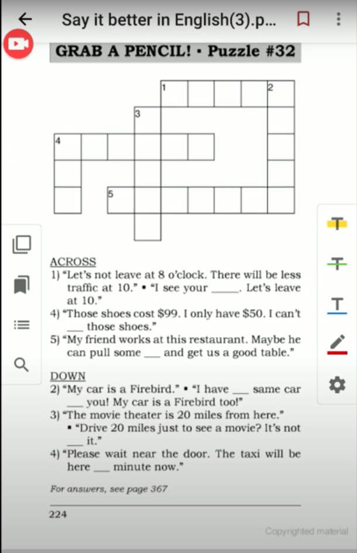
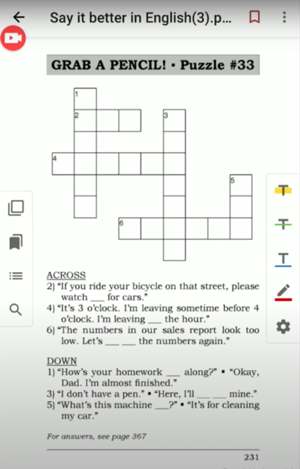
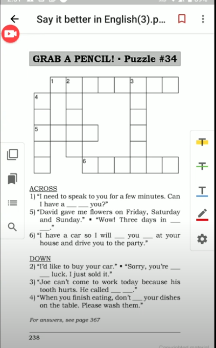
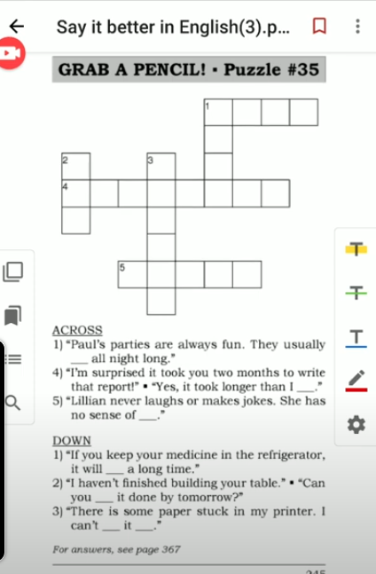

[Say It Better 10](https://www.youtube.com/watch?v=5NFn9Q9Lbe0&list=PLjGyCF-b63jgheXXlZhfBIb2W65vktvOf&index=14)
| No | Form | Word                | Meaning                | Example                |Reference                |
|---------------------|---------------------|---------------------|---------------------|---------------------|---------------------|
|1||I see your point|အင်း နားလည်တယ် သဘောပေါက်တယ်   I understand your opinion or feelings|eg.   1)   A: I can't work with these things all around me!   B: Yes, I see your point but it's just for a few days.   2)   A: If you buy a car, you won't have enough money to buy a house.   B: I see your point, but I need a car to get to work.   3)   A: You often borrow my car and use all the gas! Gas is expensive.   B: Yes, I see your point. I'll buy gas next time.   ||
|2||<b> it's not worth it</b> |မတန်ဘူး   it requires too much effort for a small result|eg.   1) Tom, it's not worth it.   2)   A: Are you going to paint your house?   B: No, It's not worth it. We are moving next year.   3)   A: If you clean your house, I'll give you five bucks.   B: Five bucks? No thanks. It's not worth it.  |bucks = dollars |
|3||can afford / can't afford|တတ်နိုင်တယ် မတတ်နိုင်ဘူး   have enough money / don't have enough money|eg.   1)   A: We can't afford that.   B:But we can afford this.   2) I can't afford a car, so I bought a bicycle.   3) Big Companises can afford to buy any computer system that they want. ||
|4||the same as|တူတူပဲ|eg.   1)   A: I want that one.   B: But it's the same as this one.   2)   A: I'm going to order a burger.   B: I'll have the same as you.   3)   A: Is your new office bigger than your old one?   B: No, It's the same size as the old office.   |NOT ~~same like~~|
|5||any minute now|very soon   အချိန်မရွေး မကြာခင်|eg.   1) It's going to rain any minute now.   2) Fred is outside parking his car. He'll be here any minute now.   3) Would everyone please sit down? Ivan is going to start the meeting any minute now.||
|6||pull strings|တခုခုလိုချင်လို့ အကပ်နဲ့လုပ်တာ အသိနဲ့လုပ်တာ   use personal contacts to get something|eg.  1)   A: Hi Fred. This is your old friend Bob. Could you help me get tickets to....   B: How did you get tickets.   C: How did you get tickets?   A: I pull some strings.   2)   A: How did he become vice president of the company   B: His father is the president. His father pulled some strings. သူ့အဖေရဲ့အကပ်နဲ့ရသွားတာ   3)   A: I'd like to work for ABC Company.   B: My uncle works there.   A: Maybe he can pull a few strings for me.   ||
|7||<b> lend </b> someone something|ချေးပါ give something to someone for a short time _ they will return it later   NOTE ~~could you borrow me~~|eg.   1) Hey Bob, could you lend me $50.   2) I lent Susan my jacket, but she never gave it back to me. She borrowed it from me last year!   3)   A: I forgot to bring my cell phone.   B: Here, I can lend you my phone.   ||
|8||within the hour|less than one hour after from now  တနာရီအတောအတွင်း|eg.   1) If you take the medicine now, you'll start to feel better within the hour.   2) I'm going to the bank now. I'll be back within the hour.||
|9||<b> go over </b> something|check the details of something တခုခုကိုစေ့စေ့စပ်စပ် ပြန်စစ်ဆေးတာ   သေချာပြန်ကြည့်|eg.   1) $247.84!? I want to go over these numbers! Soap $4.99, milk $2.99, bread....   2) Let's go over the travel arrangements. Your flight departs on Tuesday at 9:35 p.m. and...   3) Make sure you go over the contract carefully before you sign it.||
|10||<b> How's </b> something <b> coming along</b>| အခြေအနေဘယ်လိုလဲ   ဘယ်လိုတွေဖြစ်နေပြီလဲ   tell me about the progress of something that is not finished|eg.   1)   A: How's the job coming along?   B: Fine, We're almost finished.   2)   A: How's your project coming aling?   B: It's coming along fine.   3)   A: How's the report coming along?   B: We are half-way through.   ||
|11||<b> What's </b> something <b> for </b>|ဒါဘာအတွက်သုံးတာလဲ   What is the purpose of something|eg.   1)   A: What's that for?   B: It's for cutting wood.   2)   A: What are these machines for?   B: For making bread.   3)   A: What's this key for?   B: It's for the bathroom.   ||
|12||<b> watch out </b>|be careful of somethng that can be dangerouse|eg.   1). Watch out for that saw!   2) Watch out! There's a hole in the road!   3) When you swim in the ocean, watch out for sharks.||
|13||<b> leave </b> something somewhere|အဲ့ဒါကို ဒီနားမှာ ထားခဲ့   let something stay somewhere;   forget something somewhere|eg.   1) Wait a minute. Please don't leave this wood here.   2) I think I left my glasses on your desk.   3)   A: Where should I put this book?   B: Just leave it on the table. I'll put it away later.    |put it away - သိမ်းတာ , throw away - လွှင့်ပစ်တာ|
|14||call in sick|နေမကောင်းဘူးလို့ဖုန်းဆက်ပြီးပြောတာ|eg.   1)   A: This is Steve. I can't come to work today. I don't feel well.  B: It's Steve. He's calling in sick.   2)   A: Where's Bob? He's not at his desk.   B: He called in sick.   3) Susie called in sick today, so the sales department is short by one person.|short by - |
|15||Can I have a word with you?|စကားလေးနည်း၂ လောက်ပြောလို့ရမလား (၂ယောက်ထဲ သီးသန့်ပြောချင်တာမျိုး)​|eg.   1)   A: Steve, Can I have a word with you?   B: You were late again today.  2)   A: Can I word a word with you?   B: Yes.   A: We have to change the time of the meeting.   3)   A: Can I have a word with you?    B: Can you wait five minutes? I'm on the phone.    ||
|16||in a row|ဆက်တိုက်|eg.   1)   A: You were late 3 days last week.   B: ...and 3 days in a row this week.   2) We went to Japan three years in a row. In 2004, 2005 and 2006.   3) I exercised on Monday, Tuesday, Wednesday and Thursday. Is ti healthy to exercise four days in a row? ||
|17||pick someone up|လာကြိုတာ|eg.   1) I'll pick up at 7 o'clock.   2)   A: How did you get to the doctor?   B: My husband picked me up at work and drove me.   3) Rob's plane arrives at 4:30 p.m. tommorrow. I'll pick him up at the airport.||
|18||in luck / out of luck|lucky/ unlucky|eg.   1)   A: You are in luck! These are the last 2 seats.   B: I'm out of luck.   2)   A: Would it be possible to see the doctor today?   B: You're in luck. A patient just canceled. You can come in at 2 o'clock.   3) Oh no! We're out of luck. The store has already closed.||
|19||<b> last </b> three hours|ကြာတာ|eg.   1) That movie was so long! It lasted 3 hours.   2)   A: How long did the Second World War last?   B: It lasted six years, from 1939 to 1945.   3)   A: I hope the meeting doesn't last long.   B: I think it will last about an hour.   |It's last long - ကြာရှည်ခံတာ|
|20||<b> get </b> something <b> done </b>|ကိုယ်ကိုယ်တိုင်လုပ်တာမဟုတ်ဘူး သူများကိုလုပ်ခိုင်းလိုက်တာ  finish something  တခုခု ပြီးအောင် လုပ်တာ|eg.   1)   A: It's late! Why don't you go home?   B: I want to get this work done tonight.   2)   A: When can you get the job done?   B: I can get it done by Friday.   3) I can't get everything done today. I'll finish tomorrow.|I'll get it done   I've get it done.|
|21||<b> take longer than </b> someone <b> expected </b>|မျှော်လင့်ထားတာထက် ပိုကြာတာ   လိုတာထက်ပိုကြာ   need more time than originally planned|eg.   1)   A: Today is Friday! You haven't finished yet.   B: It's taking longer than we expected.   2) I thought it would take two hours to drive to your house, but it took three hours. It took longer than I expected.   3) I was supposed to finish this job today, but it's taking longer than I expected. I'll finish it tomorrow.|It's more expensive than I expected|
|22||have a sense of humor|ဟာသဉာဏ်ရှိတာ|eg.   1)   Jenny has a sense of humor.   Ann has no sense of humor.   2) I'd like to marry a man who has a sense of humor.   3) It's important to have a sense of humor when life gets stressful.||
|23||<b> can't get</b> something <b> down / in / out / open </b> |ဖွင့်မရဘူး ထုတ်မရဘူး ထည့်မရဘူး  Say this when something is difficult to do.|eg.   1)   I can't get my jacket down! jacketကိုဖြုတ်မရတာ   I can't get this nail out!  I can't get this drawer in.   I can't get the door open!   2) My disc is stuck in my computer! I can't get it out!   3) My suitcase is full. I can't get my shoes in.||
|24||<b> last </b> 20 years |လွန်ခဲ့သော   ကြာရှည်ခံ   can function or can be used for 20 years. |eg.   1) I used good wood. These cabinets will last 20 years.   2) I buy leather shoes because leather lasts a long time.   3) I bought a cheap radio. It lasted six months. Then it broke.||
|25||||||
|26||||||
|27||||||

## NOTE 
### Revision

> Give me a hand.  
> I am glad you brought it up.  
> bring up --- ဒီမှာ ကြီးပြင်းလာတယ်ဆိုတာမျိုးမှာလည်း သုံးတယ် I was born and brought up in Yangon.  
> I was born and bred here.  
> I have been living here since I was born. / thrgouhtout my life . 
> My grandma brought me up. အဘွားကကျွေးမွေးစောင့်ရှောက်လာတာ  
> My grandma brings me up  
> She brought up 3 kids.  
> I had better get going.  
> I am returning his call.   
> Don't hang up.  
> move on.  
> I have lived here long enough. It's time to move on.  
> Don't give up. You need to move on.  
> Let's get a move on.  

had better --- should -- present / future 
> အခုပဲဖြစ်ဖြစ် Future မှာပဲဖြစ်ဖြစ်လုပ်သင့်တာဆိုတာမျိုးမှာသုံးတယ်  
> I had better go now.  
> You had better concentrate on the exam.  
> She'd better get here soon or she will miss the bus.  

had better not === should not 
> He had better not leave his bag here. Someone might steal it.   
> You had better not speak in Burmese in class.  
> You had better not tell her the secret.   
> Had I better tell her the secret ?   

> nosebleed နှာခေါင်းသွေးလျှံတယ် 
> I have a nosebleed.  
> I am getting old.    
> heatstroke အပူရှပ်တာ     
> I have a sore throat.  
>  sore eye မျက်စိနာတာ  
> eyesore မျက်စိစပါးမွှေ'စူးတာ   
> That main is an eyesore.   
> That red building is a real eyesore.  

> We don't see eye to eye စိတ်သဘောချင်းမတိုက်ဆိုင်တာ

## Puzzle

