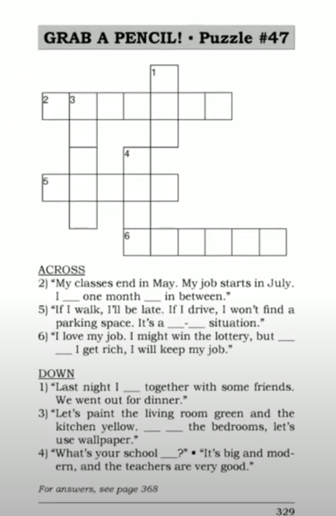
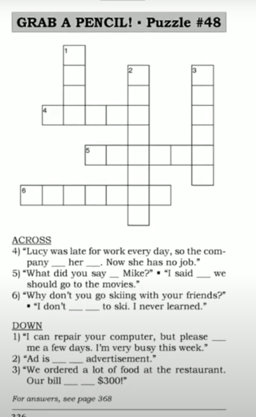

[Say It Better 13](https://www.youtube.com/watch?v=JVbqT_9NZVA&list=PLjGyCF-b63jgheXXlZhfBIb2W65vktvOf&index=17)

| No | Form | Word                | Meaning                | Example                |Reference                |
|---------------------|---------------------|---------------------|---------------------|---------------------|---------------------|
|1||he <b> was successful </b>   he <b> succeeded </b>   he <b> had success </b>||eg.   1) We had a lot of success with the imax light. Bob was very successful. He succeeded in getting 500 orders.   2) I'd always wanted to climb MOUNT Everest and finally I succeeded.   3) I had a lot of success with importing. I was successful becuase I worked hard. |NOT ~~he success~~ NOT ~~he successful~~|
|2||on average|about; around   ပျှမ်းမျှအားဖြင့် |eg.   1) We sold, on average, 300 units a month.   2) Childern watch, on average, five hours of television every day.   3) I cook chicken, on average, once every two months. ||
|3||do well|be financially successful   ကောင်းကောင်းလုပ်နိုင်တာ|eg.   1) Our West Mall shop is doing well, but our East Mall shop is not doing well.   2) Two years ago, I didn't do very well. I made only five sales. But I did well last year. I made over 70 sales!   3) Look at Frank's expensive new car! He must be doing well. |do badly
|4||the bottom line is|the main idea is;   the thing I'm really trying to say is   အဓိကပြောချင်တဲ့အကြောင်းအရာကတော့   အဓိကအချက်ကတော့|eg.   1) I worked hard on the project. I tried my best. But the bottom line is I couldn't finish it.   2) He's lazy, his work is not good ,and he's late every day. The bottom line is we have to let him go. |let him go - အလုပ်ဖြုတ်ပစ်လိုက်ရတော့မယ်|
|5||<b> Could you go over </b> that <b> again ? </b>|ပြန်ပြောပေးပါဦ:|eg.   1)   A: Please give the blue copy to me, sign the yellow copy and put it in the blue drawer, keep the green copy and sign the pink copy and put in the green order.   B: Could you go over that again.   2) Could you go over the instructions again? I didn't understand everything you said.   3)   A: .... then turn left and then right and then...   B: Sorry, I'm not following you. Could you go over the directions again.  ||
|6||have a good time||eg.   1)   A: See you 2 weeks Bob. Have a good time.   B: Thanks, I will.   2)   A: Mom, I'm going to my firend's house now.   B: Okay, have a good time.   3)   A: My sister will be here any minute now. We're going out of dinner.   B: Have a good time.|Have a nice weekend   Have a nice trip
|7||<b> hear of </b> something / someone|ကြားဖူးသလား   know that something / someone exists|eg.   1)   A: I come from Oshawa.   B: Oshawa? I've never heard of that.   A: It's small city in Onatario   2)   A: The newspaper says that Sharon Stanley died!   B: Who is she? I've never heard for her.    3)   A: Have you seen the movie Danger Zone?   B: No, but I've heard of it. My sister told me about it.   ||
|8||<b>Is</b> something <b>included?</b>|ပါပြီးသားလား   Is the cost of something already added on to the price|eg.   1)   A: I'd like room is breafast included?   B: No, Sir. Breakfast is charged separately. It's $12.50.   2)   A: I'm interested in this laptop for $1,999. Is the carrying case inlcuded?   B: Yes, you get the laptop and the case, all for $1,999.   3)   A: How much is this watch?   B: $100.   A: Is tax included?   B: No, With tax, it comes to $107. |NOT ~~Is it include breakfast?~~|
|9||<b> it depends on </b> something|..ပေါ် မူတည်တယ်   something will decide for me   NOT ~~it's depend~~|eg.   1)   A: What are you going to do today: read or swim ?   B: It depends on the weather.   2)   A: How much does it cost to mail a package?   B: It depends on the weight.   3)   A: Are you going to buy one shirt or two?   B: It depends on the price.   ||
|10||on leave|ခွင့်ယူတာ   having planned absence from work|eg.   1)   A: I'm looking for Bob Beckham.   B: Sorry, he's on leave this week.   2)   A: Does Nancy still work here?   B: Yes, but she's on leave taking care of her mother.   3) My wife is on maternity leave. We just had a baby, so she has three months off. |NOTE: on maternity leave = absent from work to give birth |
|11||<b> bring </b> someone <b> up to date </b>|ဘာတွေဖြစ်နေပြီလဲပြောပါဦး   ဘာဖြစ်တာလဲ ပြောပြပါဦး   ပြောပြမယ်   tell someone the most recent information |eg.   1)   A: Can you bring me up to date?   B: Sure, On Monday Mr. Templeton called you. He didn't leave a message. Yesterday Diane Lane came to see you. And this morning ...   2)   A: Please bring me up to date on the computer problem.   B: I fixed it. Then it broke again. Now it's at the repair shop.   3)   A: How's Ann? I haven't seen her for years!   B: Let me bring you up to date. She got married, moved to Japan, and now she teaches English.  ||
|12||<b> Can you tell me how to get to </b> a place. |This is polite way to ask for directions|eg.   1)   A: Can you tell me how to get to Bluebird Mountain?   B: Keep going down this road and turn right at the market.   2)   A: Can you tell me how to get to Whitman's Jewelers?   B: Take the elevator to the third floor and turn left.   3)   A: Can you tell me how to get to the human resources department?   B: Go down the hall and you'll see it.   |Can you tell me the way to ... |
|13||<b> even if </b> it rains|ဒီလိုဖြစ်နေရင်တောင်မှ   it might rain, but rain is not important -- rain will not change the situation   NOT ~~even it rains~~|eg.   1)   A: I'm going to climb to the top   B: It might rain.   A: I don't care. Even if it rains, I'm going to climb to the top.   2) Jose is a great student. He studies every day. Even if he's tired, he studies.   3) Even if a customer doesn't buy anything, be polite to him or her.||
|14||a no-win situation|ဘယ်ဘက်ပဲ လှည့်၂ bad result ဖြစ်နေတဲ့ situation   a situation that can have only bad results.|eg.   1) This is a no-win situation.   2) When a supermarket opened near our store, we lost customers. Now, we can't sell the store. It's a no-win situation.   3) If I work, I have to pay for a babysitter. If I stop working, I will lose money. It's a no win situation.|babysitter ကလေးထိန်း |
|15||<b> have </b> time <b> off </b> |ခွင့်ယူတယ်   ပိတ်တယ်   have non-working time arranged by the company. |eg.   1)   A: I have to work at Christmas. Do you?   B: No, I have 4 days off.   2) I have a week off in July, so I might go to Spain.   3)   A: Do you work on weekends?   B: Only on Saturdays. I have Sundays off.  ||
|16||<b> get together </b> with someone |ဆုံကြမယ်  meet someone socially|eg.   1)   A: What did you do over the weekend?   B: I got together with my friend.   2) Would you like to get together next week? We could go and see a movie.   3)   A: I'm leaving next week.   B: Let's get together for lunch before you leave.   ||
|17||<b> as for </b> something|ဒါနဲ့ ပတ်သက်ပြီးပြောရရင်တော့   Say this to introduce a topic   NOT ~~about the hotel~~|eg.   1)   A: How was your holiday?   B: As for the hotel, it was great. Nice room, good food, great service. But as for the weather, it was too hot!   2) Sergio's is a good restaurant. As for the service, it's fast and the waiters are friendly. As for the price, it's pretty cheap.   3)   A: What do we need for the party.   B: As for food, we need a cake. As for decorations, let's buy some balloons.   ||
|18||<b> What's </b> someone / something <b> like? </b> |personality or characteristics ကိုမေးတာ   Tell me about someone or something|eg.   1)   A: What's Hawaii like?   B: It's hot and beautiful, and there are lots of mountains, and the people are friendly and ....   2)   A: What's that restaurant like?   B: Well, the food is spicy and it's a little expensive.   3)   A: What's your boss like?   B: He's very serious. On the other hand, he's very kind.   ||
|19||<b> short for </b> something|အတိုကောက်|eg.   1) I'm here for the interview. Please call me Jay. It's short for Jason.   2) S'pore is short for Singapore.   3)   A: I need to buy milk and a veggie.   B: What's a veggie?   A: It's short for vegetable.   ||
|20||know how |ဘယ်လိုလုပ်ရမလဲ သိတယ်   have the skill or knowleadge|eg.   1)   A: Why didn't you change the tire?   B: I don't know how.  2)   A: Do you know how to use this fax machine?   B: No, but I'll figure it out.   3) Mom knows how to type, but she doesn't know how to use computer. ||
|21||say that / says to |NOT ~~you said me~~;   NOT ~~I said him~~|eg.   1)   A: You said that she delivery was out of down.   B: No, I didn't! I said to you that it was downtown!   2)   A: What did you say to him?   B: I said that I was interested in the job.   3) She said that she has two brothers, and she told me that they're twins.||
|22||<b> let </b> someone <b> go </b>|အလုပ်ဖြုတ်ပစ်လိုက်ရတာ   take away someone's job|eg.   1) He took money from the company, so his boss let him go.   2) Our company isn't doing well. We let five people go to save some money.|They will fire/ They will laid off. အလုပ်ဖြုတ်ခံရတဲ့ဘက်ကပြော ရတာ|
|23||it comes to|စုစုပေါင်းဒီလောက်   Say this before the total amount|eg.   1)   A: How much is our bill?   B: It comes to $21.   2) I bought a lot of food last week. My bill came to $200.   3)   A: How much is this?   B: It's $6. With tax, it comes to $6.42.  ||
|24||<b> give me </b> five minutes|ခဏလောက်   Say this when you need someone to wait|eg.   1) Just give me 5 minutes. I'm almost ready.   2)   A: When can you deliver the sofa?   B: Can you give me a few days? I'm very busy this week.   3)   A: Which hotel is best?   B: I don't know, but if you give me 30 minutes, I'll find out.   ||
|||||||
|||||||
|||||||
|||||||
|||||||
|||||||

## NOTE 
### REVISION
> It's been a while since I've posted on YouTube.  
> The hands-on experience has taught me a lot.  
> Excuse me, Can I get by?  
> If I were you, I would revise the lessons and apply them in the real-live situations.  
> Causative pattern --- I have my hair washed.  
> He lost his appetite. အစာစားချင်စိတ်ပျောက်နေတာ .  
> I don't want to spoil my appetite ( by eating snacks before dinner. ) အစားစာချင်စိတ်ပျက်သွားမှာစိုးလို့    
> He had no appetite  
> I have no appetite for the fight ရန်မဖြစ်ချင်ဘူး။။   
> She has an amazing appetite for work. အလုပ်လုပ်ချင်စိတ်ပြင်းထန်တယ်။ အလုပ်လုပ်ချင်စိတ်အရမ်းရှိတယ်  
> Workaholic  
> Alcoholic  
> Shopaholic  
> After a couple of weeks, he was OK.  
> He has grown out ot that jeans. အဲ့ jean ဘောင်းဘီနဲ့မတော်တော့်ဘူး   
> Flowers are growing out that pot.  
> I'm knocking on တဖြည်းဖြည်းနဲ့အိုလာပြီ = I'm getting old   
> Stop telling fibs!!! အလိမ်အညာတွေတော့ပါတော့ fibs = lies  
> It was a bit of /quiet a tiring weekend.  

had + V3 => အတိတ်မှာကိစ ရပ် က၂ခုဖြစ်သွားတာဆိုရင် အရင်ဖြစ်တဲ့ ဟာကို Had + V3 နဲ့သုံးပါတယ်  
 
Have you ever seen   
Have you ever watched  

## Puzzle

