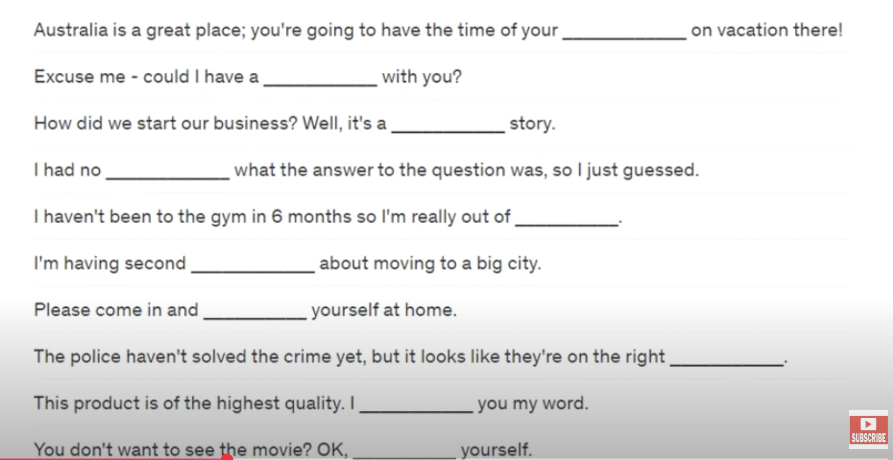

# Say it Better

[Say It Better 14](https://www.youtube.com/watch?v=pIhm80Yz_14&list=PLjGyCF-b63jgheXXlZhfBIb2W65vktvOf&index=18)

| No | Form | Word                | Meaning                | Example                |Reference                |
|---------------------|---------------------|---------------------|---------------------|---------------------|---------------------|
|1||<b> in case </b> something happens |လိုရမယ်ရ   because something might happen|eg.   1)   A: D you think it will rain?   B: Maybe. I'll bring an umbrella in case it rains.   2)   A: Don't forget to buy eggs.   B: I'd better write it down in case I forget.   3)   A: Why are you putting a smoke alarm on the wall?   B: In case there's a fire.   ||
|2||<b> it's up to </b> someone|သဘောပဲ   someone decides|eg.   1)   A: Which movie do you want to see?   B: It's up to you.   A: Hmm.... Okay. Let's see Pretty Lady.   2)   A: What color will you paint your house?   B: It's not up to me. It's up to my wife. She will decide.   3)   A: Can customers return products?   B: It's up to the manager. It depends on the situation.   ||
|3||during something|တခုခုလုပ်နေစဉ် ကာလ   at the same time as something   during + noun |eg.   1) Please don't talk during the movie!   2) During the flight, I read two books.   3) We visted friends during our vacation.   4) During the meeting, I fell asleep. |NOT ~~during we watch the movie~~ |
|4||What's taking so long?|ဘာလို့အဲ့လောက်တောင်ကြာနေတာလဲ   Why is something taking a long time.|eg.   1)   A: What's taking so long?   B: There's a long line/queue.   2) We've been waiting for the bus for an hour! What's taking so long?   3)   A: He still hasn't arrived. What's taking so long?   B: He's stuck in taffic.   ||
|5||sleep in|နှပ်နေတာ   wake up later than usual --- by choice   အိပ်ယာမထပဲ နှပ်ချင်လို့နှပ်နေတာ |eg.   1) I love to sleep in on Sundays.   2) I can sleep in tomorrow morning becuase I have the day off.   3) I feel great! I slept in until 9 o'clock this morning.||
|6||<b> speaking of </b> something |ဒီလိုပြောမှပဲ ဒါကိုသတိရသွားတယ်   Say this when a word makes you think of a new topic|eg.   1)   A: These flowers smell nice.   B: Speaking of flowers, look what I bought.   2)   A: I want to mail this letter.   B: Speaking of mail, did you get a postcard from Dave?   3)   A: Joe bought a new car.   B: Speaking of cars, I left my bag in your car. Did you find it?   ||
|7||<b> How are you getting </b> somewhere|ဘယ်လိုသွားလဲ ဘယ်လိုလာလဲ   Ask this to find out if someone is going to take a plane, train, car, bus, etc. |eg.   1)   A: I'm going to Danton City next weekend to see my aunt.   B: How are you getting there?   A: I'm taking the train.   2)   A: How are you getting to the conference?   B: By taxi.   3)   A: How are you getting home after the party?   B: Jane's going to drop me off.   |Let's take taxi/train/bus စီးရအောင်   I'll give you a ride - ကားကြုံခေါ်သွားတာ|
|8||Could I ask you a favor?|အကူအညီလေးတောင်းလို့ရမလား   Ask this before requesting someone's help.|eg.   1)   A: Could I ask you a favor?   B: Sure.   A: Could you mail this letter for me.   2) Julio, could I ask you a favor? Could help me read this form? It's in Spanish and I can't understand it.   3)   A: Could I ask you a favor?   B: Yes?   A: Could you give me a hand with these boxes? ||
|9||How would you like to pay?|Do you want to pay by cash, check or credit card?   ဘယ်လိုပေးချင်သလဲ |eg.   1)   A: How would you like to pay for your ticket?   B: By credit card please.   2)   A: Your bill comes to $47.95. How would you like to pay?   B: By cash, please.   3)   A: How would you like to pay?   B: I'll pay by check.   |NOTE: pay <b> by </b> cash, check or credit card|
|10||<b> There's something wrong with </b> something|တခုခုတော့အခြေအနေမကောင်းဘူးထင်တယ်|eg.   1) There's something wrong with my printer.   2) There's something wrong with the air conditioner. It's making a funny noise.   3) There's something wrong with my leg. It hurts when I walk.||
|11||how soon|what is the earliest time   ဘယ်လောက်မှာအစောဆုံးလာမလဲ   ဘယ်လောက် စောစော ---- မလဲ |eg.   1)   A: I'm busy right now.   B: How soon can you come?   2)   A: How soon can you finish the project?   B: We can get it done by Friday.   3)   A: How soon can you start working?   B: I can start on Monday.   ||
|12||Can I ask what it's regarding|ဘာအကြောင်းအရာ လို့များပြောလိုက်ရပါမလဲ   ဘာကိစလို့ပြောလိုက်ရပါမလဲ   Ask this to learn why someone wants to speak to someone. |eg.   1)   A: I'm here to see Ann Kim.   B: Can I ask what it's regarding?   A: I'm here to fix her computer.   2)   A: I'd like to see the manager!   B: Can I ask what it's regarding?   A: I bought a computer here and it's broken.   3)   A: (on the phone) May I speak to Mr.Yi?   B: Can I ask what it's regarding?   A: It's regarding his account at Union Bank.   ||
|13||<b> has nothing to do with </b> someone / something |ဒါနဲ့မဆိုင်ဘူး   does not concern or involve someone/something|eg.   1)   A: Is my printer broken?   B: No. The problem has nothing to do with your printer. The problem is this cable.   2)   A: Did you quit your job because of the pay?   B: No, it has nothing to do with pay. I want to start my own company.   3)   A: Are you angry with me?   B: No, I'm angry with Paul. It has nothing to do with you. မင်းနဲ့ဒီကိစနဲ့မဆိုင်ဘူး   ||
|14||can't make it|မလာဖြစ်ဘူး မလုပ်နိုင်ဘူး   not able to attend|eg.   1)   A: My wife and I are having a party on Friday night. Can you come?   B: Sorry, I can't make it. I have other plans.   2)   A: Is Bob coming to the movie?   B: No, he's working late. He can't make it.   3)   A: The meeting starts at 3 o'clock sharp.   B: I can't make it by three. I'll be a little late.  ||
|15||make sure|confirm;ensure   သေချာပါစေနော်|eg.   1) Make sure she eats her vegetables. And make sure Tommy brushes his teeth. And make sure he..   2)   A: Please make sure we have enough chairs for the meeting.   B: I've already made sure.   3) Could you make sure you turn off the computer before you leave? ||
|16||an hour <b> late </b>|ဒီလောက်တောင်နောက်ကျနေပြီ   NOT ~~late an hour~~|eg.   1)   A: They told us to come at 7 o'clock.   B: It's 8 o'clock now. We are an hour late.   2) I'm stuck in traffic right now. I'll be a few minutes late.   3) I got to the doctor's office on time, but the doctor was 20 minutes late! ||
|17||dressed up|ကောင်းကောင်း ကန်းကန်း၀တ်စားထားတာ   wearing their best clothes|eg.   1) Everyone is dressed up! I thought this was a barbeque!   2) My wife likes to get dressed up. But I prefer casual clothes.   3)   A: Why are you so dressed up?   B: I have a meeting with the president of the company.    ||
|18||might be|သိပ်တော့မသေချာဘူး ၉၅% sure ဖြစ်တယ်   Say this when you are 95% sure about something|eg.   1)   A: Mr.Lee, this must be your brother.   B: That's right. This is my brother Alfred.   2) I took my shoe to the repair shop a month ago. It must be ready by now.   3) I just called the store, but no one answered the phone. It must be closed.|might - possible   might ထပ်တော့ပိုသေချာတယ် |
|19||on the other hand|တဖက်ကကြည့်ပြန်ရင်လည်း|eg.   1)   A: (thought) He's so handsome!   A: (thought) On the other hand, he's boring!   2) Studying medicine is very interesting. ON the other hand, it's very difficult.   3)   A: London is a beautiful city.   B: Yes, but on the other hand, it rains a lot.  ||
|20||to tell you the truth|အမှန်အတိုင်းပြောရရင်တော့ ပွင့်၂လင်း၂ပြောရရင်တော့   Say this when you want to speak honestly -- often before saying something negative|eg.   1)   A: Are you excited about the new baby?   B: To tell you the truth, I'm not excited, I'm worried. Babies are expensive!   2)   A: How was my speech?   B: Good, but to tell you the truth, it was a bit too long.   3) He's a kind teacher, but to tell you the truth, his class is boring.||
|21||<b> put </b> someone <b> in charge </b>|ခဏတာ၀န်လွှဲပြောင်းပေးတာ   give someone the job of leader or supervisor|eg.   1)   A: Tom, there's a phone call for you.   B: I'm putting you in charge.   2) If my husband and I go out, we put our oldest son in charge of home.   3) I put Sara in charge of the party because she is good at organizing events.||
|22||<b> keep </b> someone <b> posted </b>|တယောက်ယောက်ကိုအကြောင်းကြားနေတာ Information ပေးတာ   ဘာတွေပြောင်းလဲနေပြီလဲဆိုတာ လှမ်းပြောတာ   give someone information when there are new developments|eg.   1)   A: Has she had the baby yet?    B: Not yet but I'll keep you posted. I'll call you when something happens.   2)   A: Did the new client sign the contract?   B: No, but I'll keep you posted. I'll call you when he signs.   3)   A: The workers will start building today.   B: Please keep me posted on their progress.   ||
|23||the day before yesterday|တနေ့က   NOT ~~yesterday before yesterday~~|eg.   1)   A: How old is he?    B: He was born the day before yesterday so he's 2 days old.   2) I was sick the day before yesterday, but yesterday I felt fine.   3) It was a 50 hour bus ride! We left the day before yesterday and we arrived today. ||
|24||once a year|တနှစ်မှာတခါ   NOT ~~one year one time~~|eg.   1) Wake up Tom! This only happens once a year!   2)   A: I exercise once a week.   B: Really? I only exercise once every two or three weeks.   3)   A: How often do you check your email?   B: Once a day.   A: I check mine twice a day, sometimes three times a day.  ||
|||||||
|||||||
|||||||
|||||||
|||||||
|||||||
|||||||

## NOTE 
### REVISION
> Success -- /k/ သံပါတယ်  
> Road -- UK rəʊd / US roʊd  
> Row -- UK rəʊ / US roʊ  
> Road trip --- road trip checklist ---- shopping list  
> Snacks  
> Drinks  
> Blanket --- market --- ticket --- Toilet --- Wallet  
> First aid kit  
> Sunscreen  
> Insect repellent --- ခြင်မကိုက်အောင်လုပ်တဲ့ အရည်  
> Sunglasses  
> Camera  
> Toiletries ---  / schwa / ဆပ်ပြာရည် တို့ သွားတိုက်ဆေးတို ့ကို ပြောတာ။  
> Toilet paper  
>  Toilet roll --- အိမ်သာသုံး paper  
> Toilet soap  
> Toilet Train/Training  
> Extra shoes  
> Wallet  
> We avoid tourist traps.   
> Tourist Traps လူအရမ်းစည်တဲ့နေရာ   
> We went to some places which are off the beaten track. လူသူအရောက်အပေါက် နည်းတဲ့နေရာကိုသွားခဲ့တယ်။  
> Package holidays   
> Go Sightseeing  
> Mountain  
> Mountainous areas  
> Rolling mountains  
> A work-life balance   
> I'm not working. I'm talking to my students. My work is inspiring.   
> I feel rewarded.    
> It never feels like work.  
> I love my students.  
> Communication with them is like talking to my friends.  
> When you do what you love, you never have to work a day in your life.  
> Thanks and I get your concern. စိတ်ပူပေးတာ ကျေးဇူးပါ  
> My job and my personal life were once separate.  
> JOB / WORK was what I had to do to pay the bills / to survive.  
> I want to stand on my own feet.  
> But that's not the case anymore. အခုအဲ့လိုမဟုတ်တော့ဘူး   
> I'm doing what I love right now!  

## Puzzle

# Quiz 

### My answer
1) 
2)
3) 
4) 
5) 
6) 
7) help
8)  
9) 
10) make

[Quiz Answers](https://www.youtube.com/watch?v=ISFqloFxUGU&list=PLjGyCF-b63jgheXXlZhfBIb2W65vktvOf&index=20)

# Old Sayings စကားပုံ

[Old Sayings](https://www.youtube.com/watch?v=JeQb7euvbhI&list=PLjGyCF-b63jgheXXlZhfBIb2W65vktvOf&index=21)

- It's RAINING CATS AND DOGS = It's raining heavily. မိုးအရမ်းရွာတာကိုပြောတာ
- Don't throw the baby out with the bath water = အစုတ်ရှင်းရင်းအကောင်းပါရောပါသွားတာမျိုးကိုသတိထားရအောင်ပြောတဲ့ စကားပုံမျိုး
> Meaning be careful that you don't throw away something valuable in a rush to get rid of unnecessary and unwanted items.
- Costs an arm and a leg = စျေးအရမ်းကြီးတာပဲ extermely expensive
> describe that is considered to be exteremely expensive or excessively pricey.
- Don't let the cat out of the bag = လျို့၀ှက်ချက်တွေကို လွှတ်ခနဲ့ပြောမိတာ
> Meaining don't reveal a secret or disclose some specific information which needs to be kept quiet. It can also be used to refer to someone who is a "blabbermouth".   
> blabbermouth - like chatter box  
- Don't look a gift house in the mouth. = အလကားရတဲ့နွား သွားဖြဲမကြည့်နဲ့ / စောတကတက်တာတွေလုပ်မနေနဲ့လို့ပြောချင်တာ 
- Sleep Tight - I toss and an turn. ဟိုတွေးဒီတွေးနဲ့ ဟိုလှည့်ဒီလှည့်နဲ့ အိပ်မပျော်ဘူး - ကောင်း၂ အိပ်ပျော်အောင် အိပ် 
> We often hear parents say to their childer when putting them to bed, " Night night, sleep tight". It means have a good sleep, sleep well.  
> We are in the tight corner.အကြပ်အတည်းဖြစ်နေတာ
- The pot calling the kettle black သူခိုးကလူပြန်ဟစ်တယ်
> A common little pharse used to describe someone who accuses someone else of having faults or flaws that they themselves have.  
> She accused me of theft. The pot's calling the kettle black.
- Born with a silver spoon in this mouth  = ရွှေဇွန်းကိုက်ပြီးမွေးလာတာ မပူမပင်ပဲမွေးလာရတာ
- Mutton dressed as lamb = အိုတာကအိုနေပြီ နုပျိုချင်လို့ ဆင်ယင်ထားတယ် .... // ဒေါင်းယောင်ဆောင်သောကျီး??? 
> A rather derogatory phrase use to describe an older woman who has dressed up in an attempt to look younger than she really is. Often her choice of clothing, jewellery and makeup seems inappropriate for her age.
- Let sleeping dogs lie = အိပ်နေတဲ့ခွေးသွားမနိုးနဲ့ . အဲ့ပြဿနာကိုသွားဆွမနေနဲ့ လို့ဆိုတာမျိုးမှာ ပြောချင်တာ . အသာလေးထားလိုက် သွားဆွမနေနဲ့ 
- Cat got your tongue = ရန်ဖြစ်တဲ့အခါမျိုး မှာ ပြန်ပြောဦးလေ စကားမပြောတတ်ဘူးလား ဆိုပြောတာမျိုး 
> has the cat got your tongue. ပြန်ဖြေဦးလေ ပြောစရာ စကားလုံးမရှိတော့ဘူးလား
- Don't count your chickens before they hatch တွက်ရေးကတော့စက်သူဌေး . ကြိုပြီးအများကြီးတွက်မနေနဲ့ဆိုတာမျိုးမှာလည်းသုံးတယ်. ကြိုပြီး တရားသေတွက်မနေနဲ့ 
> hatch ဉကနေအကောင်ပေါက်တာ   
- EAT HUMBLE PIE - တောင်းပန်တိုလျီုးရတာ . တော်၂ကြီးတောင်း၂ပန်လုပ်ယူရတာ . မျက်နှာပျက် အရှက်ကွဲပြီးမှ တောင်းပန်ရတာ
> To eat humble pie means to admit to being wrong about something, whilst maybe feeling a bit humiliated ( မျက်နှာပျက်ရတာ ) ​or submissive ( ကျိုး၂နွံ၂နဲ့အရမ်းကိုနှိမ့်ချပြီးမှတောင်းပန်ရတာမျိုး ) at the same time. Often it's after somene else has pointed out your error or mistake, forcing you to make an apology.  
> humble ထောင်လွှားမှုမရှိတာ   
- Let you hair down  စိတ်လွတ်လက်လွတ် ၁ ခါလောက်ပျော်ပါဦး  ဆိုပြီးပြောတဲ့နေရာမှာသုံးတယ် / အပြောင်းအလဲ အနေနဲ့ တခါတလေလေး စိတ်လွတ်ကိုယ်လွတ်နေလိုက်ပါဦး
> This is a rather light hearted way of suggesting that someone should go out and have some fun for a change. It means leave your inhibition behind and allow yourself to behave more freely than usual.  
> stress out  
- NO SPRING CHICKEN  မငယ်တော့ဘူးလေ 
> If you are no spring chicken, then the chances are you are not as young as you used to be!   
> This little saying is used to describe someone who is past his or her prime and can no longer do the things they were once able to do when they were young.  
> prime time အကောင်းဆုံး အရွယ်။   
> TV Program မှာဆိုရင် Prime time show / Prime time advertising - လူကြည့်များတဲ့အချိန် 
- POSH အကောင်းစား / သားနားတယ်
> A POSH HOTEL  
> A POSH CAR    
> A POSH WEDDING    
> You looks posh on your new dress  
> Where else than Britain are the elegant and well to do described as posh.  
> Yes, posh means fashionably luxurious, upmarket and stylish.  
- A BIRD IN THe HAND IS WORTH TWO IN THE BUSH    လက်ထဲမှာရှိတဲ့အခါက အ၀ေးမှာရှိတဲ့အရာထက်ပိုတန်ဖိုးရှိတယ် 
> This 16th century proverb warns against taking unnecessary risks and suggests that you should keep what you have and not risk losing it by going after more.  
- COOKING THE BOOKS စာရင်းလိမ်တာ / စာရင်းဇယား အချက်အလက်တွေကိုလိမ်တာ   
> Someone said to be cooking the books is thought to be deliberately distorting a company's financial accounts, often with the aim of avoiding the payment of tax.   
> They cook the books to avoid tax.  
- FROG IN YOUR THROAT အသံ၀င်နေတာ
> I have frog in my throat. 
- MINDING YOUR P'S AND Q'S လက်လွတ်စပယ်မပြောနဲ့ / polite ဖြစ်တဲ့ manner သူများကို respect ပေးတဲ့ manner တွေကို လက်လွတ်စပယ်မလုပ်နဲ့ သေချာလုပ်လို့ ပြောာချင်တာ 
> This is said as a gentle warning to behave in a correct and polite manner. A mother might say to her child " mind your P's and Q's when we are out this afternoon", meaning be polite and remember to say please and thank you.
- UNDER THE WEATHER နေသိပ်မေကာင်းဘူး 
> Feeling sick, Feeling unwell  
> This is a frequently used saying used to describe someone that is feeling sick and unwell.
- WHITE ELEPHANT  စျေးကြီးပေး၀ယ်ထားပြီး အသုံးမ၀င်တာ 
> The expression " White Elephant" is used to describe an expensive possession which is troublesome (စိတ်အနှောင့်အယှက် ဖြစ်ကတာ ဒုကေပးတာ ) or useless and cannot easily be disposed of.   
> For example, a holiday home that is too run down to sell and yet too costly to upkeep, could be described as a "white elephant".   
> He is a troublesome child.   
> Troublesome cough   
