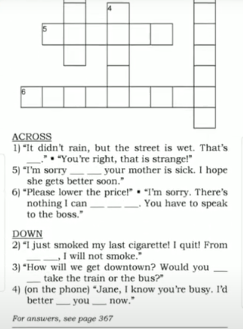
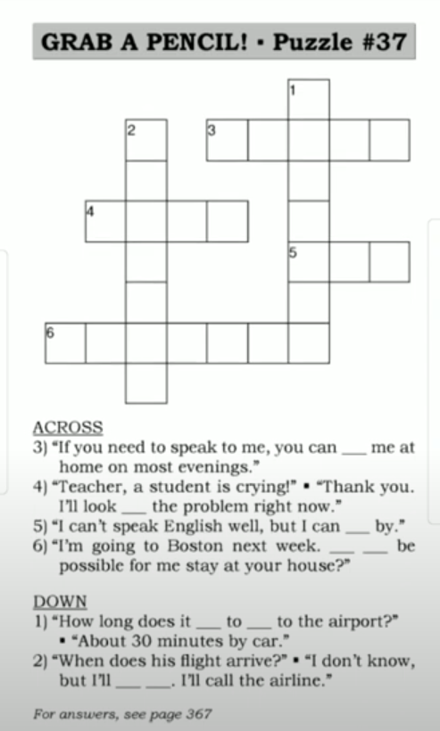
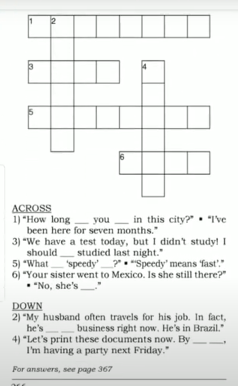
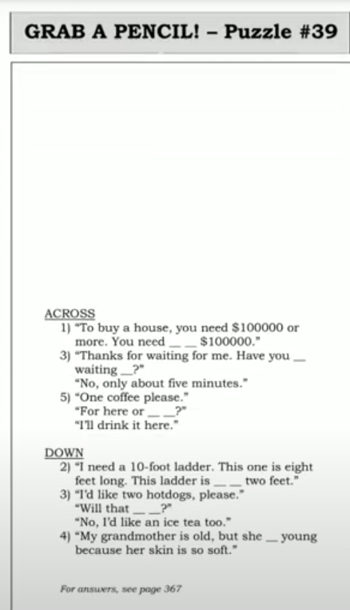

[Say It Better 11](https://www.youtube.com/watch?v=ol2xHWAtBD4&list=PLjGyCF-b63jgheXXlZhfBIb2W65vktvOf&index=15)

| No | Form | Word                | Meaning                | Example                |Reference                |
|---------------------|---------------------|---------------------|---------------------|---------------------|---------------------|
|1||I'm sorry to hear...|ကြားရတာစိတ်မကောင်းပါဘူး   When something bad happens to some one say this to show you care .|eg.   1) I'm sorry to hear about your grandfather.   2)   A: I'm sorry to hear about your car accident.   B: Thanks, I'm feeling better now.   3)   A: My dog died.   B: I'm sorry to hear that. I know how much you loved your dog.   ||
|2||Would you prefer a or b|ဒါကြိုက်သလား ဟိုဟာကြိုက်သလား   Do you want a or b? |eg.   1)   A: Would you prefer a cat or a dog?   B: I'd prefer a dog.   2)   A: Would you prefer coffee or tea?   B: Coffee, please.   3)   A: Would you prefer to meet at my office or yours?   B: It's up to you.   ||
|3||from now on|အခုကစပြီးတော့|eg.   1) Frow now on, let's put our shoes up at the top.   2) I just won $10,000! From now on, I'm going to take taxis, not buses!   3) Judy is our new receptionist. From now on, she will answer the phone. ||
|4||that's funny|ထူးဆန်းတယ်   that's strange|eg.   1) That's funny. I had 3 fish yesterday.   2)   A: Did you get my letter?   B: No.   A: That's funny. I mailed it two weeks ago.   3)   A: Sandra isn't here yet.   B: That's funny. She called me two hours ago and said she was on her way.   |3 Fish - s/es မကပ်ဘူး . Different fishes အမျိုးအစားမတူတာတွေ မှာမှ s/es လိုက်ပါတယ်|
|5||There's no nothing I can ( about it ) |ဆောရိးပါ ဘာမှ လုပ်မပေးနိုင်ပါဘူး   Say this when you cannot help someone|eg.  1) I'm sorry. There's nothing I can do about it.   2)   A: I want to take the 2 o'clock train!   B: But, I told you it's fully booked. There's nothing I can do.   3)   A: Taxi Driver, please drive faster!   B: There's nothing I can do! We're stuck in traffic.   ||
|6||I'd better let you go|ဖုန်းချလိုက်တော့မယ်နော်   Say this to end a phone call politely|eg.  1)   A: Mrs.Kobori, I'd better let you go now.   B: Okay. Bye Sue. See you soon.   2)   A: I'd better let you go now.   B: Okay. Keep in touch.   A: I will, Bye.   3)   A: I'm sure you're busy. I'd better let you go.   B: Okay. Nice to talking to you.   ||
|7||look into something|investigate; research   စေ့စေ့စပ်စပ် လုပ်တာ စုံစမ်းတာ|eg.   1)   A: I'm going to Shanghai next week.   B: I'll look into hotels for you.   2) We just moved to a new city. We're looking into schools for our children.   3)   A: There's a problem with my bill.   B: I'll look into the problem right away.   ||
|8||reach someone|ဆက်သွယ်လို့ရတာ   contact someone by phone, email, fax, etc.|eg.   1) You can reach me on my mobile, or at the Shanghai Hotel at 0086-21-339-3245 or by fax at 0086-21-868-4527, or by email or ...   2)   A: How can I reach you? ဘယ်လိုဆက်သွယ်လို့ရမလဲ  B: You can email me at this address.   3) I'll be away on business for a few days, so you won't be able to reach me at the office.||
|9||get by|အရမ်းအကောင်းကြီးတော့ မဟုတ်ပေမယ့် Manage လုပ်လို့ရတယ်   manage but with difficulty|eg.   1)   A: Can you speak Chinese?   B: Not very well, but I can get by.   2) My car broke down. I have to get by with my bicycle for a few days.   3) We don't have much money, but we can get by if we don't spend much.||
|10||How long does it take to get to a place? |အဲ့ကိုရောက်ဖို့ ဘယ်လောက်ကြာမလဲ   How much time is needed to arrive at a place?|eg.   1)   A: How long does it take to get to the Shanghai Hotel by taxi.   B: About 30 minutes.   2)   A: How long does it take to get to Montreal from Toronto?   B: It takes about five hours.   3)   A: How long does it take to get to the bank.   B: Not long.It's a five-minute walk.  ||
|11||Would it be possible for someone to...|This is polite request. Say this when you don't know if someone can help you|eg.   1) Would it be possible for me to see the doctor today? I don't have an appointment.   2)   A: Would it be possible for you to lend me $300.   B: $300! That's a lot of money!   |lend ထုတ်ပေးရတဲ့ဘက်က |
|12||find out|မသိလို့သိအောင်လုပ်တာ   get a piece of information|eg.   1)   A: Is the restaurant still open?   B: I'm not sure. I'll find out.   2)   A: Let's go see the new movie tonight.   B: Okay. I'll find out when it starts.  3)   A: How old is Jane.   B: I don't know, but I can find out. I'll ask his sister.  ||
|13||How long have you been in this place|ဒီမှာနေတာဘယ်လောက်ကြာပြီလဲ   Ask this to know the amount of time spent in the place someone is now.|eg.   1)   A: How long have you been in Shanghai?   B: For 2 days, I arrived yesterday morning.   2)   A: How long have you been in Hong Kong?   B: I've been here for six months, but I still can't find a job!   3)   A: How long have you been in this country?   B: For five years. I grew up in Sri Lanka and moved here five years ago.   ||
|14||What does this mean? |ဘာအဓိပ္ပာယ်လဲ   NOT ~~What mean this?~~   NOT ~~ This mean what?~~|eg.   1)   A: Excuse me. What does this mean?   B: It means 'no smoking'.   2)   A: What does 'large' mean?   B: It means 'big'.   3)   A: What does 'Insatiable' mean?   B: I don't know. Look it up in the dictionary.  ||
|15||away on business|အလုပ်ကိစနဲ့ခရီးသွားတာ   in another city or country on a business trip|eg.   1)   A: Hi Mary. I haven't seen Alan this week.   B: He's away on business in China.   2)   A: Are you free next week?   B: No, I'll be away on business.   3)   A: I tried calling you next week, but I couldn't reack you.   B: I was away on business.  |away on holiday အားလပ်ရက်ခရီးသွားတာ|
|16||should have something|နောင်တရတဲ့အခါမျိုးတွေမှသုံးပါတယ်   Say this when something was a good idea, but you didn't do it. You made a mistake and now it's too late|eg.   1) I should have brought my umbrella.   2) Fred wanted to marry you, but you said no. Now he's very successful. You should have married him!   3) The copier is broken becuase you put in too much paper. You shouldn't have put in so much paper.||
|17||someone is back|ပြန်လာပြီ|eg.   1) Mr.Lee is back.   2)   A: Miss French went to the bank. Is she back?   B: No, she isn't back yet.   3) My father was in the hospital for a few days,but now he's back home.||
|18||by the way|စကားမစပ်  Say this to introduce a different topic.|eg.   1)   A: ...and the Imax sales increased by 7%.   B: 7% increase. That's good. By the way, did you watch the football game last night?   2)   A: Are you ready to go to lunch?   B: Yes, let's go. By the way, your mother called.   3) ... then we visited Paris and then we went to London. By the way, how's your sister.||
|19||short by|ကွာနေတာ ဟနေတာ လိုနေတာ|eg.   1) I have $97. I'm short by $3.   2) We need 10 players for our football game. We have eight players, so we're short by two.   3)   A: My cash register is short by $15.   B: You must have given a customer too much change.   ||
|20||Have you been waiting long? |စောင့်နေရတာကြာပြီလား   This is a polite question to ask someone waiting for you.|eg.   1)   A: Sorry, I'm late. Have you been waiting long?   B: No, I just got here.   2)   A: Have you been waiting long?   B: No, just a few minutes.   3) I'm sorry to keep you waiting. Have you been waiting long? ||
|21||Will that be all|ဒါအကုန်ပဲလား ဒါပဲလား   Is that the only thing you want?|eg.   1)   A: I'll have a salad and an iced tea,please.   B: Will that be all.   A: Yes, that's it, thank you.   2)   A: I'd like a cheeseburger to go, please.   B: Will that be all?   A: No. And a Diet Coke too.  ||
|22||For here or to go|ဒီမှာစားမှာလား ယူသွားမှာလား|eg.   1)   A: Is that for here or to go?   B: For here, please.   2)   A: One cheeseburger, please.   B: Is that for here or to go?   A: It's to go.   3)   A: I'd like two coffees, please.   B: For here or to go?   A: For here, please.||
|23||look / look like|look + adjective   look like + noun   ပုံစံတူတာ|eg.   1)   He looks successful!   He looks like a movie star!   He looks Italian!   He looks like a model!   2)   A: You look tired.   B: That's because I worked late every night this week.   3)   A: My new haircut is too short. I look like a boy.   B: No, you look beautiful.   ||
|24||<b> at least </b> 21|အနဲဆုံး   21 or more than 21|eg.   1)   A: I wonder how much that jacket costs.   B: At least $200. Maybe even $300! It's made of leather.   2) That piano is heavy! You need at least four people to help you carry it.|at the most, at most|
|25||get back to someone|ပြန်ခေါ်လိုက်မယ်နော် ပြန်ပြောပေးမယ်နော်  contact someone as a reply by phone, email, fax, etc. |eg.   1)   A: What's your flight number?   B: I'm not sure. Can I get back to you?   2) I don't have that information right now. I'll get back to you later.   3) Please get back to me by email or phone.||
|26||as far as I know|သိသလောက်   သိသလောက်ကတော့  based on the information I have|eg.   1)   A: Is flight 207 on time?   B: Yes, as far as I know.   2)   A: Is Ali going to the meeting?   B: Yes. As far as I know, he's going. Bob told me everyone is going.   3) There was a fire at the bank! As far as I know, nobody was hurt. That's what I heard on the radio.   ||
|27||How was something?|အခြေအနေဘယ်လိုလဲ   It's polite to ask about someone's recent experience.|eg.   1)   A: Welcome gentlemen. How was the flight?   B: Very nice, very comfortable.   2)   A: How was your vacation?   B: It was great, thank.   3)   A: How was the conference?   B: Interesting. There were a lot of good speakers.s  ||
|28||show someone around|လိုက်ပြမယ်   take someone for a tour|eg.   1)   A: Let me show you around.   B: This is our new product here.   2) Welcome to Boston. I'll show you around the city tonight.   3) We're interested in buying this house. Could you show us around? ||
|29||stand for|အရှည်ကောက်|eg.   1)   A: What does A.S.A.P stand for?   B: It stands for "as soon as possible"   2) U.S.A stands for United States of America.   3)   A: What does FYI stand for?   B: It stands for 'for you information'.   ||
|30||make yourself/ yourselves at home|ကိုယ့်အိမ်လိုသဘောထားပြီးနေနော်   please feel relexed and comfortable |eg.   1) Make yourselves at home. I'll bring some drinks.   2) Hi James. Come in and make yourself at home. Let me take your coat.   3)   A: May I use your phone?   B: Go ahead. Make yourself at home.   ||
|||||||
|||||||

## NOTE

### REVISION
> The other days  
> Fine with me  
> Who is this?  
> It is ---  
> He is on the other line.  
> It's your turn.  
> Let's take turns driving  
> There is no point in watching the video lessons without any practice.  
> can i make a suggestion?  
> Nowadays  
> weather --- what's the weather like today?  Sunny / rainy / cloudy   
> season --- There are three seasons in our country.   
> 3 season - rainy / winter /summer   
> 4 seasons - spring / summer / autumn = fall / winter   
> climate --- ဒေသတခုမှာရှိတဲ့ ရာသီဉတု --- summer --- yangon == scorching hot   --- POL == cool   
> People visit a cool climate.  
> Climatic changes  
> Climate Change 

I haven't + v3 မလုပ်ဖြစ်တာကြာပြီ  
> I haven't uploaded the videos for " Say It Better " For long. 

## Puzzle

