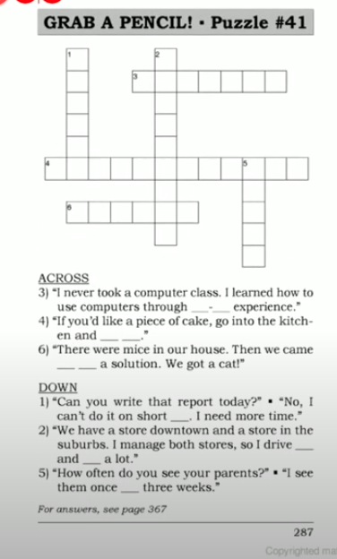
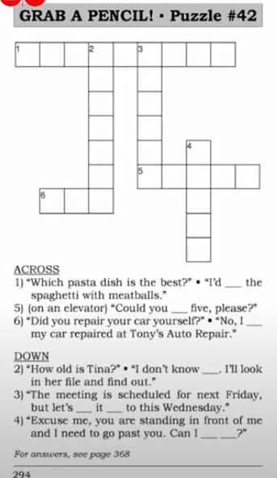
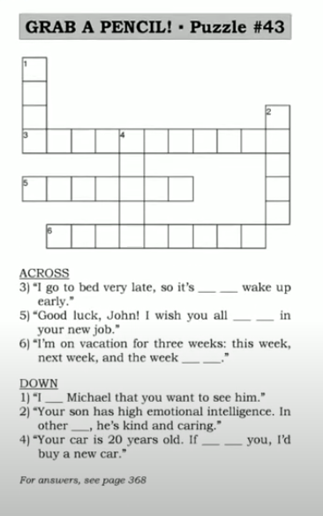

[Say It Better 12](https://www.youtube.com/watch?v=2DdHwhqQoJ4&list=PLjGyCF-b63jgheXXlZhfBIb2W65vktvOf&index=16)

| No | Form | Word                | Meaning                | Example                |Reference                |
|---------------------|---------------------|---------------------|---------------------|---------------------|---------------------|
|1||help yourself/yourselves|အားမနာနဲ့ ကိုယ့်ဘာသာထယူ ထည့်စား   ကိုယ့်ဘာသာယူလိုက်   serve your own food or drink|eg.   1) Please help yourselves.   2)   A: Can I have some more soup?   B: Sure. Could you help yourself? I have to cut the cake.   3) Ladies, if you'd like tea or coffee, please help yourselves||
|2||back and forth|ဟိုသွားလိုက်ဒီသွားလိုက် ဟိုနဲ့ဒီခေါက်တုန့်ခေါက်ပြန်ဖြစ်နေတာ   in one direction, then in the opposite direction -- repeated many times|eg.   1) All day I go back and forth to the copier.   2) That  was a long tennis game. The ball went back and forth for two hours.   3) We emailed back and forth for six months before we met.||
|3||short notice|ကပ်မှပြောတာ  without much advance warning|eg.   1)   A: Could you photocopy these by 5 o'clock?   B: By 5 o'clock? A: Sorry for the short notice but it's urgent.   2) Could you type this letter for me? I know it's short notice, but I need it in 20 minutes.   3)   A: Can you repair my car today?   B: No, sorry, I can't do it on short notice. ကပ်မှလာပြောလို့ မလုပ်မနိုင်ဘူး I have to repair a lot of cars today.   |NOTE: do something on short notice|
|4||come up with something|produce an idea or solution|eg.   1)Look Dad! I came up with an idea to make money.   2) Those birds keep eating my flower seeds. I need to come up with a solution to the problem.   3) Carl came up with a great idea for our presentation!||
|5||hands-on experience|တကယ်လက်တွေ့လုပ်ပြီးရတဲ့ Experience |eg.   1) Tommy is getting hands-on experience in business.   2) I study cooking, but I work as a waiter. This gives me hands-on experience in the restaurant business.   3) I'm an architect now, but first I worked as a builder. That hands-on experience taught me a lot.||
|6||once every four years |4နှစ်တကြိမ် 4နှစ်ခြားတခါ  NOT ~~four years once~~|eg.   1)   A: We want to watch cartoons!   B: Cartoons? The Olympics only happens once every 4 years!   2)   A: I go jogging once a week.   B: I only go once every two weeks.   3) The earth goes all the way around the sun once every 365 days.|Fortnight|
|7||Could you press 15?|elevator ထဲမှာနံပါတ်နှိပ်ပေးပါဆိုပြော|eg.   1) Could you press 15, please?   2)   A: Which floor would you like?   B: Could you press seven, please?   3) Could you press six, please? I can't reach it. Thanks. ||
|8||Can I get by?|ရှေ့ကလူကိုဖယ်ခိုင်းတာ နည်း၂ဖယ်ပေးပါဦး  ကိုယ်က ၀င်တိုးမှာမို့ အားနာတဲ့အခါမှာလည်းသုံးတယ်   Ask this when you need someone to move so you can go past them|eg.   1) Excuse me, Can I get by?   2)   A: Can I get by, please? I have to catch a train.   B: Oh, sorry.   3) Excuse me. Can I get by? I need to get off the bus here.|get on / get off - bus ကိုစီးတာတက်တာ ( step ခြေလှမ်းတွေနဲ့ ) get in / get out - car တွေ Taxiတွေ |
|9||I'd recommend something|Say this to suggest something NOTE ~~I recommend you to buy the Imax~~|eg.   1)   A: I want something modern for all of my offices.   B: I'd recommend the Imax. It's a new model and very modern.   2)   A: Do you know any good French restaurants?   B: Yes, I'd recommend Chez Pierre.   3)   A: I need exercise. What should I do?   B: I'd recommend swimming.   |NOTE: sometimes <b> recommend + _ing </b>|
|10||I don't know offhand|ရုတ်တရတ် စဉ်းစားလို့မရဘူး   လက်တန်းတော့မပြောနိုင်ဘူး   I don't have the information in my memory|eg.   1)   A: How many Imax lights have you sold?   B: I don't know offhand. Let me check.   2)   A: How many people live in London?   B: I don't know offhand. I'll look it up on the internet.   3)   A: Do you know Sam's phone number?   B: I don't know it offhand. It's in my address book.  ||
|11||have something done|ကိုယ်ကိုယ်တိုင်လုပ်မှာမဟုတ်ဘူး သူများကိုလုပ်ခိုင်းလိုက်ပါ့မယ်   Say this when you arrange something but someone else does it.|eg.   1)   A: I need them tomorrow.   B: Tom, can you deliver 150 Imx lights tomorrow?   B: I'll have your lights delivered tomorrow ( မနက်ဖြန် ပို့ခိုင်းလိုက်ပါ့မယ် )   2) There were workers in my house yesterday. I had the walls painted and I had the air conditioner repaired.   3) We make radios, but we don't make the small parts. We have the parts made by another company.   ||
|12||move something up|ရှေ့ကိုတိုးတာ   ရှေ့ကိုရွေ့တာ  change a plan to an earlier time|eg.   1)   A: I'll be on vacation next week.   B: Then, let's move the meeting up to Friday.   2) The deadline was Friday, but they move it up to Thursday.   3)   A: Lunch is scheduled for 2 o'clock.   B: That's a bit late. Can we move it up to one o'clock?   |postpone နောက်ရွေ့   a bit = a little|
|13||the week after next|နောက်အပတ်ပြီးနောက်အပတ်   the week after next week   NOT ~~next next week~~|eg.   1) Next week I'll be on vacation. How about the week after next?   2) My exam is the week after next, so I hae to study hard next week.   3) We can't get it done by next week, but we can get it done by the week after next.||
|14||I wish you all the best||eg.   1) I wish you all the best, Margaret.   2) Good-bye students. I wish you all the best next year.   3) I wish you all the best with your new business. I'm sure it will be a success! ||
|15||if I were you, I'd...|ကျနော်သာခင်ဗျားနေရာမှာဆိုရင် ဒီလိုလုပ်တယ်|eg.   1)   A: Sometimes I feel a pain right there.   B: If I were you, I'd see a doctor.   2)   A: My salary is low and I don't enjoy my job.   B: If were you, I'd look for another job.   3)   A: We've repaired our fax machine twice this year.   B: If I were you, I'd buy a new one.   ||
|16||in other words|Say this if you need to repeat soemthing a different way.|eg.   1) You need to accelerate your cardiovascular rate. In other words, you need to exercise.   2) A five-year-old child could understand this computer program. In other words, it's very easy.   3) Employees are expected to have completed all duties prior to departure. In other words, finish your work before you go home.||
|17||tell someone|NOT ~~tell to someone~~; NOT ~~tell that~~|eg.   1) The doctor told me to exercise. I told him that I hate exerciese.   2) She told him to wait. He told her that he couldn't wait.   3) I told the kids to clean up their rooms. Please tell them again! |said I needed to do exercise - say ဆို Obj မလိုပါ|
|18||it's easy to / it's difficult to|NOT ~~I'm easy to~~ / NOT ~~I'm difficult to~~ |eg.   1) It's easy to get to the airport. Just follow the signs.   2) It's difficult for me to read without my glasses. ||
|19||give up|လက်လျော့တယ်အရှုံးပေးတယ်   quit; stop doing something.|eg.   1) I called three times, but he never answered the phone. In the end I give up.   2) I feel healthier now because I gave up smoking last year. |NOTE: sometimes give up + _ing|
|20||get on / get off   get in / get out|get on / get off = for buses, trains and planes   get in / get out = for cars and taxis|eg.   1)   A: Could you tell me how to get to the circus?   B: Get off the train at Westwood Station. Then get on the 160 bus and get off at High Street. Then take a taxi and get out at Ash Street.   2) I was wearing my glasses when I got on the plane. I lost them when I got off the plane or when I got in the taxi!   3) Taxi Driver, I'd like to get out at the next street please.||
|21||even though|သော်လည်းပဲ|eg.   1) Even though he's rich and successful, he's hot a happy person.   2) ABC Printing Company is very good. So even though they charge a lot, we use the company.|even though + sentence   In spite of / Depsite + noun pharse|
|22||was/were supposed to|ဒီလိုလုပ်မယ်လို့မျှော်လင့်ထားတာ၊   ဒီလိုလုပ်မယ့်လို့ တွေးထားတာ ဖြစ်မလာဘူး   say this to talk about a plan that didn't happen.|eg.   1) You went under the ring! You were supposed to go throught the ring!   2) I was supposed to go to the meeting. I planned to go, but I didn't. I was tied up.   3) We were supposed to finish this last month, but it's still not complete.||
|23||take a chance|စမ်းကြည့်လိုက်မယ်   Try ကြည့်လိုက်မယ်   do something that might result in danger or failure|eg.   1)   A: Tom, the lion might wake up!   B: I know but I'm going to take a chance   2) The mountain was icy and dangerous, but we took a chance and climbed up.   3) We spend $10,000 an advertising. We took a chance, but it didn't work. It didn't increase sales.||
|24||on second thought|ပြန်စဉ်းစားကြည့်လိုက်တဲ့အခါ   ပြန်စဉ်းစားပြီးပြန်ပြင်ပြီးပြောတဲ့အခါ မှာသုံးတာ   Say this when you change your decision.|eg.   1) Let's meet at the library. On second thought,, let's meet at the coffee shop because the library is closed.   2)   A: I'm going to buy this tie.   B: It's $300? On second thought, I think I'll buy a different one.   ||
|25||||||
|||||||
|||||||
|||||||

## NOTE

### REVISION
> Have you been waiting long?  
> Not feeling well -- He was under the weather. နေမကောင်းဘူ:   
> Suddenly -- All of a sudden.   
> Vomit -- throw up အန်တာ -- threw up   
> At an ungodly hour အချိန်မတော်မှထဖြစ်တာ။   
> Why are you calling me at this ungodly hour?   
> Go to a hospital  
> He was admitted to hospital ဆေးရုံတင်ကတာ  
> He was released/discharged from hospital ဆေးရုံပြန်ဆင်းတာ  
> He was rushed to hospital အမြန်ဆေးရုံပို့လိုက်ကတယ်။   
> He received treatment.  
> I got wet/ soaked . မိုးမိတာ  
> The next day when I woke up, I was a bit off color. မျက်နှာဖြူဖတ်ဖြူရော်ဖြစ်တာ။   
> I got a headache /k/, a sore throat , and a runny nose (နှာစေးတာ)   
> My nose was blocked.   နှာခေါင်းပိတ်တာ။   
> I had a cold. အအေးမိတာ  
> I called in sick and reschedule the classes.  

Due to that situation, <b>we had no choice but to </b> ---    
> Due to that situation, we had no choice but to rush to hospital.      
> Due to that situation, we had no choice but to get by.  

## Puzzle

