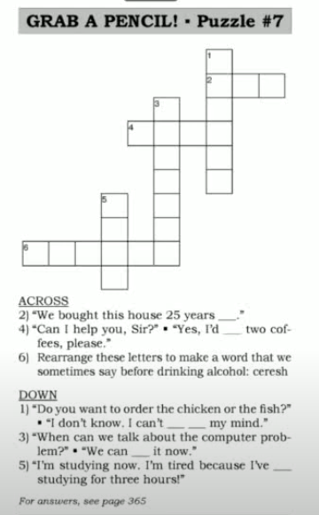
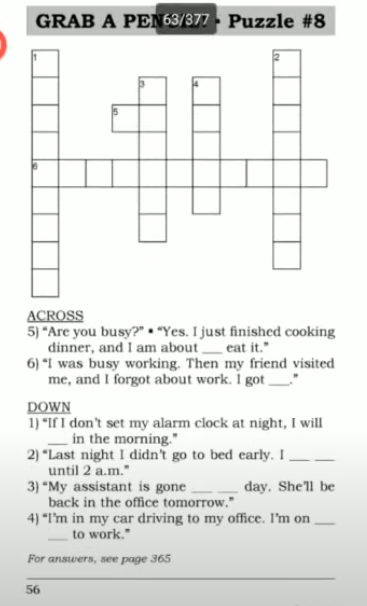
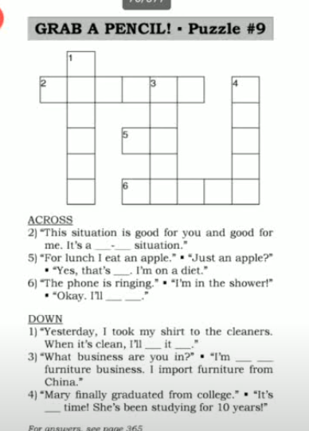
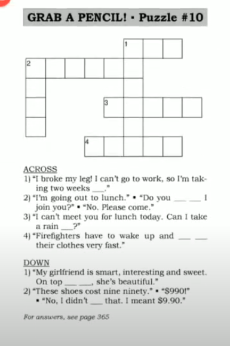

# Say It Better 

> [ Say It Better 3 ](https://www.youtube.com/watch?v=fLKmX3JhxXg&list=PLjGyCF-b63jgheXXlZhfBIb2W65vktvOf&index=5)  
> [Linked Sound](https://www.youtube.com/watch?v=SOHUfCAjR18&list=PLjGyCF-b63jgheXXlZhfBIb2W65vktvOf&index=6)


| No | Form | Word                | Meaning                | Example                |Reference                |
|---------------------|---------------------|---------------------|---------------------|---------------------|---------------------|
|1||I'd like|This is a ploite way to say what you want |eg. <br> 1) <br> A: I'd like a ticket to Stanton City. please.<br> B: One-way or a round-trip ticket? <br> 2) <br> A: Can I help you? <br> B: Yes, I'd like to send this package to Mexico City.<br> 3) I'd like one chocolate donut please.  ||
|2|I've been [v-ing] for [ a long time]|I've been waiting for a long time.||eg. <br> 1) I hope we arrive soon. We've been sitting in this airplane for seven hours. <br> 2) Please wake up the baby. He's been sleeping for four hours .||
|3||make up my mind|decide|eg. <br> 1) <br> A:Which one would you like?  <br> B:I can't make up my mind. <br> 2) <br> A: Are you going to buy the blue car or the green car. <br> B: I don't know. I haven't made up my mind yet.<br> 3) He's finally made up his mind. He's going to study business.||
|4|--- ago|two weeks ago||eg. <br> 1) I started tihs restaurant 30 years ago. <br> 2) <br> A: I just got maried. <br> B: When <br> A: Three days ago. <br> 3) He left the office five minutes ago. You just missed him.||
|5||Cheers||eg. <br> 1) <br> A:Cheers! <br> B:Cheers! To a long happy life. <br> 2) <br> A: Cheers. To your health <br> B: Cheers. <br>  ||
|6|discuss [ something ] |||eg. <br> 1) Dont be angry. Can we discuss the problem? <br> 2) We need to discuss the travel arrangements. <br> 3) We can discuss the situation at the meeting if you bring it up. ||
|7||stay up|ပုံမှန်ထက်နောက်ကျပြီး မှ အိပ်ယာ ၀င်တာ |eg. <br> 1) You go to sleep. I'm going to stay up. <br> 2) When my husband works late, I stay up until he gets home. <br> 3) <br> A:Why are you so tired today? <br> B: I stayed up the last night. <br> ||
|8||oversleep|ပိုအိပ်မိတာ|eg. <br> 1) wake up! we overslept!. <br> 2) I'm behind schedule this morning because I overslept. <br> 3) I use three alarm clocks so that I never oversleep||
|9|about to do something||တခုခုလုပ်တော့မယ့်ဆဲဆဲ <br> going to do someting very soon|eg. <br> 1) We are about to start? Where's Tom? <br> 2) <br> A:Is Dan still here ?  <br> B:Yes, but you'd better talk to him now. He's about to leave <br> 3) <br> A: Have you written that letter yet. <br> B: No, but I'm about to do it right now. <br> ||
|10||on my way|လာနေပြီ|eg. <br> 1) <br> A:Tom, Where are you? You're late. <br> B:I'm on my way. <br> 2) <br> A: Did you call the police? <br> B: Yes, they're on their way. They will be here very soon. <br> 3) <br> A: We need some milk. <br> B: Okay. I'll ask Dad to buy some on his way home <br>   ||
|11||get sidetracked|become distracted from something 
important <br> တခုခုလုပ်နေရင်းကနေချော်တော်ငေ့ါသွားတာ / လမ်းကြောင်းလွဲသွားတာ |eg. <br> 1) <br> A: You burned dinner. <br> B: Yes, while I was cooking, my mom called and I got sidetracked. <br> 2) I didn't finish my homework. There was a good movie on TV, so I got sidetracked. ||
|12||gone for the day|ဒီနေ့အတွက်တော့ပြန်မလာတော့ဘူး . <br> အပြီးရုံးဆင်းသွားတယ် အပြိး ပြန်သွားတယ် ဆိုတာမှာသုံးတယ် <br> someone will not come back that day.|eg. <br> 1) <br> A: Do you know where Mr Lee is ?  <br> B: He's gone for the day. <br> 2) <br> A: Could I speak to Mr.Couga? <br> B: Sorry, he's gone for the day. He will be in the office tomorrow morning. <br> 3) Kate's gone for the day. You can reach her at home. ||
|13|in the [ ] business|in the lighting business|တခုခုလုပ်နေတယ်|eg. <br> 1) That's Mr.Lee. He's in the lighting business. <br> 2) Mr. Saito is in the shoe business. He ex-ports shoes. <br> 3) <br> A:What do you do?  <br> B: I'm in the publishing buiness. I'm an editor. <br> ||
|14||a win-win situation|၂ဦး၂ဖက်အကျိုးရှိတာ|eg. <br> 1) Buying a house is a win-win situation. If you sell it, you make money. If you keep it , you make money. <br> 2) I rent a room in my brother's house. He needs the extra money. I need a room. It's a win-win situation.||
|15||that's it|ဒါပဲ. ရပြီ တော်ပြီ|eg. <br> 1) <br> A: Are there any more cookies <br> B: No, That's it. <br> 2) <br> A: You're going to Europe? To France? To Germany? To Spain? <br> B: Just to Italy. That's it. <br> 3) <br> A: We have just 24 hours to finish this project! <br> B: <br> Twenty four hours ? That's it? <br> A: Yes, that's all the time we have.||
|16||it's about time|လုပ်သင့်တာကြာပေ့ါ <br> it is overduce but it is finally happening|eg. <br> 1) <br> A: Mom, I bought new jeans. <br> B: It's about time!. <br> 2) <br> A: The package arrived. <br> B: It's about time! I've been waiting for weeks <br> 3) <br> A: Sam is getting married <br> B: Great. It's about time. He's 46 years old. <br> ||
|17|get it||answer the phone|eg. <br> 1) <br> A: The phone's ringing. <br> B: I'll get it. I think it's for me. <br> 2) <br> A: The phone's ringing. <br> B: Could you get it ? I'm busy. <br> ||
|18|pick [ something ] up ||လာရွေးတာ လာယူတာ|eg. <br> 1) I'd like to pick up my wife's shoe please. <br> 2) I left my book at your house . Could I come over later and pick it up. <br> 3) <br> A:I'm from ABC Company. I'm here to pick up an evelope. <br> B: Oh yes, here it is. <br> ||
|19||Can I take a rain check?|ချိန်းထားတာတခုကို ကပ်ပြီမှဖျက်လိုက်ရလို့ အားနာပါတယ် ရက်ချိန်းလို့ရနိုင်မလား <br> ( ကပ်မှ ဖျက်တာလည်းပါတယ် . နောက်ရက်ထပ်ချိန်းချင်ပါတယ်ဆိုတဲ့ meaning လည်းပါတယ် ) <br> Can we change the plan to another time in the future|eg. <br> 1) <br> A: Do you want to go to a movie tonight? <br> B: No, I'm sick. Can I take a rain check ? <br> 2) <br> A: I have to cancel our plans for lunch today. Can I take a rain check? <br> B: Sure. How about tomorrow ? <br> 3) <br> A: Would you like to got out for dinner tonight? <br> B: Sorry, I can't make it tonight . Ca nI take a rain check. <br> ||
|20|take [ time ] off||ခွင့်ယူတာ|eg. <br> 1) <br> A: No work today>  <br> B: No, I'm sick. I took the day off. <br> 2) I took three months off after I had the baby. <br> 3) I'm going to take a week off because I need a vacation.||
|21||on top of that|in addition to; also <br> ဒါ့အပြင်|eg. <br> 1) <br> A: Tell me about yourself. <br> B: I was a taxi driver for 3 years and I'm a hard worker. On top of that, I can speak 3 languages. <br> 2) My neighbor is noisy. He plays loud music at night and he had lots of parties. On top of that , his dog barks a lot ! <br> 3) I'm very busy. I have two children, I work full-time and on top of that I take evening classes . ||
|22|put on |put clothes on|၀တ်တာ|eg. <br> 1) Here's your uniform. You can put it on in the changing room. <br> 2) I ate breakfast quickly, put my coat on and ran out of the house. <br> 3) He's only two years old. He doesn't know how to put on his shoes.||
|23|take off||ချွတ်တာ|||
|24|put off||အချိန်ဆွဲတာ|||
|25||I didn't mean that|အဲ့လိုသဘောနဲ့ပြောတာမဟုတ်ပါဘူး|eg. <br> 1) <br> A: Could you call the customer? <br> B: I didn's mean that! I meant call him on the phone!<br> 2) <br> A: You're very big. <br> B: You think I'm fat! <br> A: No, I didn't meant that. I meant you're very tall. <br> 3) <br> A: I want you to work over the weekend <br> B: Boss, I can't work every weekend! <br> A: I didn't mean that. I meant this weekend.<br> ||
|26||Do you mind if I join you? |ဒီမှာလိုက်ထိုင်လုပ်လိုက်ရင အဆင်ပြေမလားဟင်ဆိုတာမျိုးမျာသုံးတာ <br> Ask this for permission to be with someone.|eg. <br> 1) <br> A:Do you mind if I join you. <br> B: Of course not. Have a seat <br> 2) <br> A: We're going to the movies. <br> B: Do you mind if I join you? <br> A: No, we don't mind. Please come along. <br> 3) <br> A: Hi Jane. Do you mind if I join you? <br> B: Actually, I'm leaving now, but you can have my seat. <br> ||
|||||||
|||||||

## Note 

Revision  
> Drop by me when you arrive YGN.  
> It's for you.  
> It's slipped my mind    
> I'm put up with my work becuase I'm under a lot of pressure.  
> Get me through via my number.  
> I can't get him through. He is offline.  
> We have to put up with it.  
> It's not the end of the world.  
> I am not following you.  
> thirtieth ၃၀ နှစ်မြောက်   
> fortieth
> twentieth  
> fiftieth  
> I can't make it မတတ်နိုင်ဘူး အဆင်မပြေဘူး မလုပ်ပေးနိုင်ဘူး

> ✅ Have a disscussion on something   
> ✅ Disucss something  
> ❌ discuss about something 

> ✅ pick someting up  
> ✅ pick up something  
> ✅ pick it up    
> ❌ pick up it  

> ✅ put something on  
> ✅ put on something  
> ✅ put it on   
> ❌ put on it  


> Have you + 過去分詞 + yet? 「もう〜しましたか？」
```
Have you eaten yet?
　→ もう食べましたか？

Have you finished your homework yet?
　→ 宿題はもう終わった？

Have you seen that movie yet?
　→ あの映画、もう見た？

Have you talked to her yet?
　→ 彼女ともう話しましたか？
```

> Yesterday when you call me, I was about to have lunch.  
> What do you do ? = What is your job?  
> Anything else.

Present Perfect Continuous Tense 
> အတိတ်ကတည်းက လုပ်နေတယ် အခုထိ တောက်လျှောက်လုပ်နေတယ်။ 
> I've been working here for three years. ( For = during , since = စမှတ်ကိုပြောချင်ရင် Since )  

## Tips to become proficient in English ( Part 3 )
Ge<u>t</u> <u>u</u>p   
Ge<u>t</u> <u>o</u>ut  
I wan<u>t a</u> cu<u>p o</u>f tea.  
It'<u>s a</u> pie<u>ce of</u> cake.  
Ha<u>ve a</u> nice day.  
What ti<u>me is i</u>t?  
How'<u>s i</u>t going?


## Puzzle





