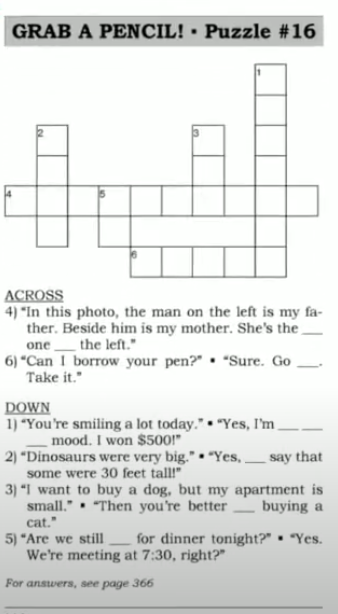
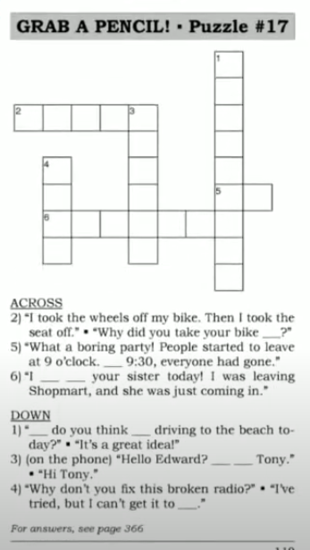

# Say It Better 

> [ Say It Better 5 ](https://www.youtube.com/watch?v=LaY8CWNqBZk&list=PLjGyCF-b63jgheXXlZhfBIb2W65vktvOf&index=8)  

| No | Form | Word                | Meaning                | Example                |Reference                |
|---------------------|---------------------|---------------------|---------------------|---------------------|---------------------|
|1||in good condition/in perfect condition|အခြေအနေကောင်းပါတယ်ဆိုတဲ့နေရာမှာသုံးတာ|eg.   1)   A: Is it in good condition?    B: Don't worry. It's in perfect condition အကောင်းအတိုင်းပါပဲဗျာ   2) My car in perfect condition because I take good care of it.   3) Our house used to be in bad condition. We fixed everytin, so now it's in good condition. ||
|2||he just stepped out|အခုလေးတင်အပြင်ထွက်သွားတာ|eg.   1)   A: May I speak to Tom Smith?   B: I'm sorry, he just stepped out. He should be back in a few minutes.   2)   A: Could I speak to Eva?   B: She just stepped out of the office. She'll be back soon.   3)   A: Fred's not in his office. Is he gone for the day.   B: No, he just stepped out.    ||
|3||I'll put you through|လိုင်းလွဲပေးတာ|eg.   1)   A: Could I speak to Mr.Lim?   B: He's not here right now, I'll put you throught to his assistant.   2)   A: I'd like to speak to the manager.   B: One moment, please, I'll put you through.   ||
|4||There's been a delay|ကြန့်ကြာမှုလေးတွေနည်း၂ ဖြစ်နေလို့ပါ|eg.   1)   A: My Delivery is late.   B: I'm sorry Mr. Harper. There's been a delay.   2)   A: Has the package arrived yet?   B: No, there's been a delay because of bad weather.   3) There's been a delay in production. One of the machines broke down.||
|5||for good |forever;permanently, အပြီးသွားတာကို ပြောတာ|eg.   1)   A: I'm going to Bay City.   B: For how long?   A: For good, I got a job there.   2) There were ants in my kitchen.But after I used ant killer, there werer gone for good!   I've tried to quit smoking before, but this time I'm quitting for good.||
|6|hear from [someone]||တစုံတယောက်ဆိက သတင်းစကားကြားရတာ ( receive communication from someone )|eg.   1)   A: Have you heard from Linda?   B: No, I haven't! No postcard, no email, no phone call.  2)   A: I heard from Jack last week. He emailed me.   B: How is he?   3) I haven't heard from my sister for a long time. I hop she's okay. ||
|7||That's too bad|တစုံတယောက်ဆိက မကောင်းတဲ့သတင်းစကားကြားရတဲ့အခါ အယ်..ဟုတ်လား . ဖြစ်ရတယ် ဆိုတာမျိုး response မှာသုံးတာ|eg.   1)   A: ...so the delivery was late, the customer was angry and now I have to find a new driver.   B: That's too bad.   2)   A: I didn't get the job.   B: That's too bad. But I'm sure you'll get one soon.   3)   A: Our computer system has been down for five days!   B: That's too bad.   ||
|8||What's this charge for? |ask this when you don't understand an amount on your bill or receipt.( ဒါကဘာအတွက်ကောက်ထားတာလဲ ) |eg.   1)   A: What's this charge for?   B: Peanuts.   A: But we didn't order any peanuts.   2)   A: What's this charge for ?   B: That's the shipping charge.   3)   A: Excuse me. What's this charge for on my receipt?   B: It's the tax.   ||
|9|to [ someone / something ] |||eg.   1) (at a wedding) To the bride and groom!   2) (at a gathering of friends) To friendship!   3) (at a business dinner) To our new partner ship!   4)   A: Really? I can't belive it! My wife is pregnant!    B: Congratulations! To the new baby.   ||
|10||I heard it through the grapevine|ဘယ်ကနေစတာ.ဘယ်သူကစပြောတယ်ဆိုတာမသိတော့ဘူး( someone told me something as gossip or a rumor)|eg.   1)   A: Tom's wife is pregnant   B: How did you know?   A: I heard it through the grapevine.   2)   A: Alex lost his job.   B: Who told you that?   I heard it through the grapevine.   3)   A: Are you sure the company is closing ?   B: No, I'm not sure. I heard it through the grapevine.   ||
|11|hear back from someback||တယောက်ယောက်ဆီက စာလာတယ် သတင်းကြားတယ်(recevie a reply from someone)|eg.   1) I heard back from Linda!   2)   A: Did you get the job?   B: No, I had an interview, but I never heard back from the company.   3) I emailed Ted yesterday, and I hope to hear back from him soon.||
|12||really like / really enjoy / really want |NOT ~~very like~~ / NOT ~~very enjoy~~ / NOT ~~very want~~|eg.   1) I really like this company, and I really enjyo driving. I really want this job.   2) Jane, I really enjoyed your presentation today.   3) I really like my English class. I really want to imporve my writing.||
|13|<b>better off</b> do<b>ing</b> something||ဒါတွေလုပ်လိုက်ရင် ပိုကောင်းမယ်(say this to show a better choice|eg.   1)   A: Should we go now?   B: No, There's too much traffic now. We're better off going later.   2)   A: The train takes three hours. The bus takes five hours.   B: Then, I'm better of taking the train.   3) You're better off buying the size 8.||
|14|<b>the second one from the right/left</b>||the thing beside the thing on the right/left ဘယ်ဘက်/ညာဘက်ကရေရင် ဒုတိယမြောက်|eg.   1)   A: I'd like the second one from the right.   B: Sure.   2) This is a photograph of my family. I'm the second one from the right.   3) Please pass me that book on the shelf, the second one from the left. ||
|15|<b> Are we still on for </b>today?||ဒီနေ့တွေ့မှာသေချာတယ်နော်ဆိုပြီး လှမ်းcheckတာ ask this to confirm an arrangement.|eg.   1)   A: Are we still on for tonight?   B: Yes. Let's meet at the theater at 7 p.m   2) Hi Ali. Are we still on for today.   3)   A: Are we still on for lunch tomorrow?   B: Actually, I have to cancel. Can I take a rain check?   ||
|16|<b>they say</b>||somepeople say ပြောကြတာပဲ (Say this when you hear something. but it's not important who said it)|eg.   1) They say it's going to rain today.   2) They say it's important to get eight hours of sleep a night.   3)   A: The ecomomy is bad this year.   B: Yes, but they say it will imporve soon.  ||
|17||go ahead|do it ( လုပ်ပါ ယူပါ )​|eg.   1)   A: Hey Ali, can i try one of your clubs?   B: Go ahead.   2)   A: Do you mind if I have the last cookie?   B: Go ahead. I've had enough.   3)   A: I'd like to start the meeting now.   B: Okay, everyone's here, so go ahead.  ||
|18||<b> in a good mood/in a bad mood|စိတ်အခြေအနေကောင်းတယ်မကောင်းဘူး (​feeling happy/unhappy)|eg.   1)   A: I'm in a good mood when I play golf.   A: I'm in a bad mood when it rains.  2)   A: The boss looks angry.   B: He's in a bad mood because sales are down this week .  3)   A: You're in a good mood today.   B: Yes, I am. Tomorrrow is a holiday!   ||
|19|<b> run into </b> someone||တယောက်၂ နဲ့မမျော်လင့်ဘဲတွေ့တာ|eg.   1)   A: Sue Smith! What a suprise to see you!   A: I ran into Sue Smith today.   2) I ran into Fred Schiffer at the airport. I was arriving from Seoul, and he was on his way of Chicago.   3) Sometimes I run into Mohamed at the bank. We both go on Mondays. ||
|20||<b> I can't get </b>something<b>to work</b>|ဒါဘယ်လိုလုပ်ရမလဲမသိဘူး မလုပ်တတ်ဘူး I can't make something function|eg.   1) I've tried and tried, but I can't get this to work.   2) I've pressed all the buttons on this DVD player, but I can't get it to work.   3) I can't get my printer to work. There's something wrong with it.||
|21||<b>take</b> it <b>apart / put </b> it <b> back together</b>|တစစီ ဖြုတ် / ပြန်ဆင် dismantle it / assemble it.|eg.   1) I took it apart. Now I can't put it back together.   2) I took my computer apart to replace a part, and now I can't figure out how to put it back together.   3)   A: What's wrong with the air conditioner?   B: I don't know. I'll take it apart and look inside.   ||
|22|<b> this is </b>Jenny||တယ်လီဖုန်း Conversation တွေမှာသုံးပါတယ်|eg.   1)   A: May I speak to Debbie please?   B: Hi. This is Bil from your English class   2)   A: May I speak to the manager?   B: This is the manager speaking. How can I help you?   3)   A: Can I speak to Mr.Daw?   B: Can I ask who's calling?   A: This is Mary from ABC Company. ||
|23|<b> by </b> 9 o'clock||နောက်ဆုံးထားပြီးတော့|eg.   1)   A: I want you to be home by 9.   B: Okay Dad. Not later than 9 o'clock.   2) We need to be at the airport by 3 o'clock. Our flight leaves at 4 o'clock and we need one hour to check in.   3) I need the report by 5 o'clock at the latest||
|24|<b> What do you think about </b>do<b>ing</b> something? ||ဒါလုပ်မယ်ဆိုရင်ဘယ်လိုသဘောရလဲ|eg.   1)   A: What do you think about increasing our prices?   B: I think it's a good idea.  2)   A: What do you think about moving to a bigger house.   B: Good idea! We need more room.   3)   A: What do you think about buying a new car?   B: I don't think we need a new car.  ||
|25|we <b> don't see eye to eye</b>||အမြင်မတူတာမှာသုံးတယ် This is a polite way to say we don't agree|eg.   1)   A: If we increase prices, we will lose customers.   B: But we will increase profits.   C: We don't see eye to eye on this.   2) Steve loves the movie. Mary hates it. They don't see eye to eye on the movie.   3) We both agree on the problem. But we don't see eye to eye on the solution.   4) We don't see eye to eye on this case. ||
|26||<b> on sale / for sale </b>|စျေးချထားတာ / ရောင်းရန်ရှိတယ်|eg.   1) It's on sale. (~~$199~~ NOW $150)   2)   A: Can I buy that one?   B: No, it's not for sale.   3) Hats are on sale at Shopmart this week. They are 20% off.   3) Look! That house is for sale. I wonder how much it is. |For rent - ဌားရန်|
|27|<b> What's </b> something <b>made of?</b>||ဘာနဲ့လုပ်ထားတာလဲ |eg.   1)   A: It feels so soft. What's it made of?   B: It's made of silk.   2)   A: What are these shoes made of?   B: They're made of leather.   3)   A: What's the table made of?   B: It looks like glass, but it's actually made of plastic.    ||
|28|its <b> worth </b> $199||တန်ရာတန်ကြေးဒီလောက်ရှိပါတယ် ( its real value is $-- )|eg.   1)   A: $150? That's a lot of money.  B: But it's worth $199.   2)   A: This used Mercedes for sale on eBay is so cheap! It's only $12,000.  B: How much is it worth?   A: It's worth $20,000!   3) Gold s worth more than silver.||
|29|<b>plug</b> something <b>in</b>||connect something to a power toilet.ပလပ်ထိုးတာ|eg.   1) I'll plug it in for you.   2) I'll plug in the new TV so we can watch it.   3) You can plug the iron in here. Please unplug it when you're finished.|NOTE: plug something in, plug in something, plug it in, NOT ~~plug in it~~|
|30|<b> what if </b>||ဒီလိုဆိုဘယ်လိုလုပ်မလဲ what will happen if|eg.   1)   A: Come up. It's easy?   B: But what if I fall?   A: If you fall, I'll catch you.   2)   A: I don't have health insuarnce.   B: What if you get sick?   3)   A: Let's have the party outside.   B: What if it rains?   A: If it rains, we can move inside. ||
|||||||
|||||||
|||||||
|||||||
|||||||

## NOTE

#### Revision 

> Let's chip in 10,000 for the picnic.  
> What' the difference between this one and that one ?    
> We end up studying "Say it better in English ".  
> You shouldn't have.  
> I'll upload a video the day after tomorrow.  
> I'm fed up with you / this situation.  
> As long as we live here , we have to put up with it.  
> So far, so good.  
> You sound upset.  
> As a result, we have become stronger. --- if we look on the bright side 

#### Other 
> Look on the bright side! -> be optimistic(အကောင်းမြင်တာ) အကောင်းဘက်ကကြည့်ရင်တော့  
> Be optimistic / Don't be pessimistic အဆိုးမမြင်နဲ့   
> quit + v-ing => eg. quit smoking  
> Congratulations => Congratulation မှာ s ပါမယ်။ 
> I'd like to speak of congratulation of winner. ( Noun အနေနဲ့သုံးရင်တော့ s မပါဘူး )  
> grapevine နွယ်ပင်။   
> the third one from the left.  
> run into someone လူနဲ ့( come across ပစည်းတွေဘာတွေ နဲ့ )   
> What a suprise to see you!  

## Puzzle
  
  
  
  
  
