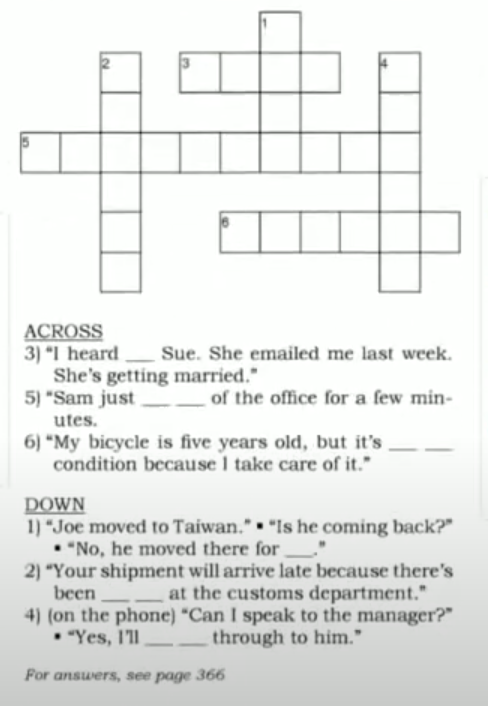
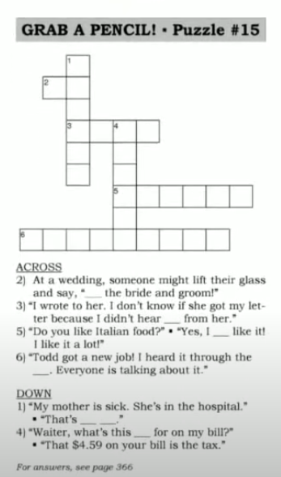

# Say It Better 

> [ Say It Better 5 ](https://www.youtube.com/watch?v=LaY8CWNqBZk&list=PLjGyCF-b63jgheXXlZhfBIb2W65vktvOf&index=8)  

| No | Form | Word                | Meaning                | Example                |Reference                |
|---------------------|---------------------|---------------------|---------------------|---------------------|---------------------|
|1||in good condition/in perfect condition|အခြေအနေကောင်းပါတယ်ဆိုတဲ့နေရာမှာသုံးတာ|eg.   1)   A: Is it in good condition?    B: Don't worry. It's in perfect condition အကောင်းအတိုင်းပါပဲဗျာ   2) My car in perfect condition because I take good care of it.   3) Our house used to be in bad condition. We fixed everytin, so now it's in good condition. ||
|2||he just stepped out|အခုလေးတင်အပြင်ထွက်သွားတာ|eg.   1)   A: May I speak to Tom Smith?   B: I'm sorry, he just stepped out. He should be back in a few minutes.   2)   A: Could I speak to Eva?   B: She just stepped out of the office. She'll be back soon.   3)   A: Fred's not in his office. Is he gone for the day.   B: No, he just stepped out.    ||
|3||I'll put you through|လိုင်းလွဲပေးတာ|eg.   1)   A: Could I speak to Mr.Lim?   B: He's not here right now, I'll put you throught to his assistant.   2)   A: I'd like to speak to the manager.   B: One moment, please, I'll put you through.   ||
|4||There's been a delay|ကြန့်ကြာမှုလေးတွေနည်း၂ ဖြစ်နေလို့ပါ|eg.   1)   A: My Delivery is late.   B: I'm sorry Mr. Harper. There's been a delay.   2)   A: Has the package arrived yet?   B: No, there's been a delay because of bad weather.   3) There's been a delay in production. One of the machines broke down.||
|5||for good |forever;permanently, အပြီးသွားတာကို ပြောတာ|eg.   1)   A: I'm going to Bay City.   B: For how long?   A: For good, I got a job there.   2) There were ants in my kitchen.But after I used ant killer, there werer gone for good!   I've tried to quit smoking before, but this time I'm quitting for good.||
|6|hear from [someone]||တစုံတယောက်ဆိက သတင်းစကားကြားရတာ ( receive communication from someone )|eg.   1)   A: Have you heard from Linda?   B: No, I haven't! No postcard, no email, no phone call.  2)   A: I heard from Jack last week. He emailed me.   B: How is he?   3) I haven't heard from my sister for a long time. I hop she's okay. ||
|7||That's too bad|တစုံတယောက်ဆိက မကောင်းတဲ့သတင်းစကားကြားရတဲ့အခါ အယ်..ဟုတ်လား . ဖြစ်ရတယ် ဆိုတာမျိုး response မှာသုံးတာ|eg.   1)   A: ...so the delivery was late, the customer was angry and now I have to find a new driver.   B: That's too bad.   2)   A: I didn't get the job.   B: That's too bad. But I'm sure you'll get one soon.   3)   A: Our computer system has been down for five days!   B: That's too bad.   ||
|8||What's this charge for? |ask this when you don't understand an amount on your bill or receipt.( ဒါကဘာအတွက်ကောက်ထားတာလဲ ) |eg.   1)   A: What's this charge for?   B: Peanuts.   A: But we didn't order any peanuts.   2)   A: What's this charge for ?   B: That's the shipping charge.   3)   A: Excuse me. What's this charge for on my receipt?   B: It's the tax.   ||
|9|to [ someone / something ] |||eg.   1) (at a wedding) To the bride and groom!   2) (at a gathering of friends) To friendship!   3) (at a business dinner) To our new partner ship!   4)   A: Really? I can't belive it! My wife is pregnant!    B: Congratulations! To the new baby.   ||
|10||I heard it through the grapevine|ဘယ်ကနေစတာ.ဘယ်သူကစပြောတယ်ဆိုတာမသိတော့ဘူး( someone told me something as gossip or a rumor)|eg.   1)   A: Tom's wife is pregnant   B: How did you know?   A: I heard it through the grapevine.   2)   A: Alex lost his job.   B: Who told you that?   I heard it through the grapevine.   3)   A: Are you sure the company is closing ?   B: No, I'm not sure. I heard it through the grapevine.   ||
|11|hear back from someback||တယောက်ယောက်ဆီက စာလာတယ် သတင်းကြားတယ်(recevie a reply from someone)|eg.   1) I heard back from Linda!   2)   A: Did you get the job?   B: No, I had an interview, but I never heard back from the company.   3) I emailed Ted yesterday, and I hope to hear back from him soon.||
|12||really like / really enjoy / really want |NOT ~~very like~~ / NOT ~~very enjoy~~ / NOT ~~very want~~|eg.   1) I really like this company, and I really enjyo driving. I really want this job.   2) Jane, I really enjoyed your presentation today.   3) I really like my English class. I really want to imporve my writing.||
|||||||
|||||||
|||||||
|||||||
|||||||
|||||||
|||||||
|||||||
|||||||
|||||||
|||||||
|||||||
|||||||
|||||||
|||||||
|||||||
|||||||

## NOTE

#### Revision 

> Let's chip in 10,000 for the picnic.  
> What' the difference between this one and that one ?    
> We end up studying "Say it better in English ".  
> You shouldn't have.  
> I'll upload a video the day after tomorrow.  
> I'm fed up with you / this situation.  
> As long as we live here , we have to put up with it.  
> So far, so good.  
> You sound upset.  
> As a result, we have become stronger. --- if we look on the bright side 

#### Other 
> Look on the bright side! -> be optimistic(အကောင်းမြင်တာ) အကောင်းဘက်ကကြည့်ရင်တော့  
> Be optimistic / Don't be pessimistic အဆိုးမမြင်နဲ့   
> quit + v-ing => eg. quit smoking  
> Congratulations => Congratulation မှာ s ပါမယ်။ 
> I'd like to speak of congratulation of winner. ( Noun အနေနဲ့သုံးရင်တော့ s မပါဘူး )  
> grapevine နွယ်ပင်။ 

## Puzzle
  
  
  
