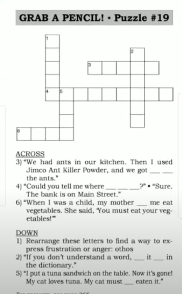
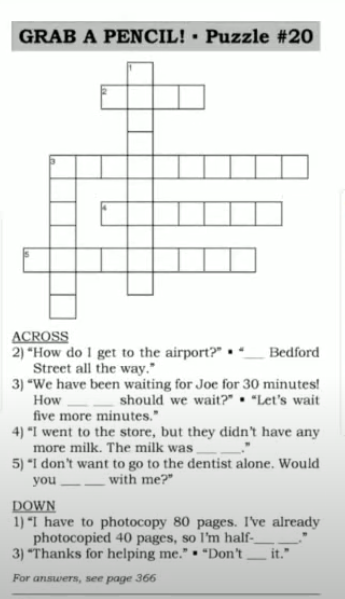

# Say It Better 

> [ Say It Better 6 ](https://www.youtube.com/watch?v=3XsJTWxD9co&list=PLjGyCF-b63jgheXXlZhfBIb2W65vktvOf&index=9) 

| No | Form | Word                | Meaning                | Example                |Reference                |
|---------------------|---------------------|---------------------|---------------------|---------------------|---------------------|
|1||he <b>let</b> me go / he <b>made</b> me run |လိုက်ခွင့်တော့ပြုတယ် ပြေးခိုင်းတယ်.   he allowed me to got he forced me to run|eg.   1)   A: Can I go with you? Please!   B: Well...Okay.   B: Run!   A: He let me go but he made me run!   2) My manager let me take two days off last week.   3)   A: My company makes us wear uniforms.   B: Really? My company lets us wear jeans.  |NOTE ~~let me to go~~; NOT ~~made me to run~~|
|2|<b>look</b> something <b>up</b>||စာလုံးကိုမသိလို့ ရှာဖွေ/တခုခုကိုရှာဖွေတာ   find a piece of information in a book or on the internet|eg.   1)   A: Tommy, you're an ignoramus?   B: Mom, what does 'ignoramus' mean?   C: Look it up.   2)   A: How did you get my phone number?   B: I looked it up in the phone book.   3)   A: I need the address of the hotel.   B: I'll look up the address on the Internet.   |NOTE: look something up, look up something, look it up. NOT ~~look up it~~|
|3|<b> get rid of </b> something||ရှင်းပစ်တာ   eliminate something   make something go away;|eg.   1) Get rid of that frog!   2)   A: You bought a new car?   B: Yes, we got rid of our old car. We sold it.   3) You can get rid of a toothache by putting ice on it.||
|4|<b> must have </b> done something||ဒီလိုဖြစ်သွားတာနေမယ် ဒီလိုဖြစ်သွားတာဖြစ်ကမယ်   ---ပဲ ဖြစ်ကမယ်   Say this when you guess about something that happened in the past, and you are quite sure.|eg.   1)   A: My bill says I owe $300,000!   B: I'm sorry. we must have made a mistake.   2) John isn't answering his phone. He must have gone out.   3) Look! There's $20 on the floor. Someone must have dropped it.||
|5||shoot|shit   စိတ်ရှုပ်တဲ့အခါမျိုးမယ်သုံးတာ|eg.   1) Shoot! I missed the bus!   2)   A: Have you seen John?   B: He's gone for the day.   A: Oh, shoot! I really needed to talk to him.   3) Shoot! I just spilled coffee on my shirt. ||
|6|<b> Could you tell me where </b> something <b> is </b> |||eg.   1)   A: Could you tell me where the post office is ?   B: It's on the next corner opposite the bank   2)   A: Could you tell me where the manager's office is?   B: It's on the second floor.   3)   A: Could you tell me where the nearest restaurant is?   B: There's a restaurant about two blocks from here.   |opposite မျက်နှာချင်းဆိုင်|
|7||don't mention it.|ရပါတယ်   This is a polite response when someone thanks you.|eg.   1)   A: Thank you.  B: Don't mention it.   2)   A: Here's your umbrella. You forgot it.  B: Oh, thank you.   A: Don't mention it.   3)   A: Thanks for mailing those letters for me.  B: Don't mention it.  ||
|18|<b> Would you mind </b> do<b>ing</b> something||တစုံတယောက်ကို လုပ်ခိုင်းတာ   Ask this to make a very polite request NOT ~~Would you mind to ~~|e.   1) Excuse me. Would you mind closing the window?   2) Would you mind moving your car out of the way? I want to park here.   3)   A: Sir, Would you mind not smoking here?   B: Sorry I'll smoke outside.  ||
|19.||sold out|ရောင်းလို့ကုန်သွားတာ |eg.   1)   A: Do you have any hairspray?   B: Sorry. The hairspray is sold out.   2) We couldn't got to the show because the tickets were sold out.   3) The fish was sold out, so I bought chicken instead of fish.||
|20||<b> half-way through</b>|လုပ်လက်စ တန်းလန်းကြီးတ၀က်|eg.   1)   A: Are you finished?   B: No, we're half-way throught.   2) This book is 1,000 pages long! I'm half-way through. I'm on page 500.   3) He's half-way through his MBA program. It's a two year program and we just finished the first year.||
|21||how much longer|ဘယ်လောက်ထပ်ကြာဦးမှာလဲ   how much more time |eg.   1)   A: How much longer do you need ?   B: About 2 more mintues.   2)   A: She hasn't finished the job yet.  B: How much longer will it take?   3)   A: How much longer do you need to cook dinner? I'm hungry.   B: Another 20 minutes. I'm only half-way through.   |How much will it take ဘယ်လောက်ကြာမှာလဲ How much longer will it take ဘယ်လောက်တောင် မှ ထပ်ကြာ ဦးမှာလဲ |
|22|<b> take </b> the highway||ဒီလမ်းကနေသွား ဟိုလမ်းကနေသွားဆိုတဲ့နေရာမယ်သုံးပါတယ်  go on the highway|eg.   1) I need you to go to 26 Main Road. <b>Take</b> the highway to Exit 21. Then <b>take</b> Kramer Street and turn right onto Main Road.   2) We got lost on our way here. We took the wrong street.   3) Don't take Main Street during rush hour. You'll be stuck in traffic.||
|23||<b>double-check</b>|သေချာထပ်စစ်ထားတာ   check again when you are not sure about something|eg.   1)   A: I think the address is 26 Main Road but I'm not sure.   B: You'd better double-check with Tom.   2)   A: Are you sure there are no mistakes in the report?   B: Yes, I checked and then I double-checked.   3) I think Ken's party is tomorrow night. But I'm no positive. I'll call him to double-check.|I'm not positive = I'm not sure.|
|24||<b> a bad connection </b>|an unclear phone connection|eg.   1)   A: Yes ....address ....Main.   B: Tom, I can't hear you! This is a bad connection   2) This is a bad connection. I can't hear you very well. Could you repeat that?   3) My battery is low, so we have a bad connection. We might get cut off.|got cut off = လိုင်းကျသွားတယ်|
|25||<b> in that case </b>|ဒိိလိုဆိုရင်   because of the thing you just said   Say this when you must change something because you get new information. |eg.   1)   A: Nobody's home.   B: In that case, leave it with the neighbor.   2)   A: Waiter, I'd like the steak please.   B: I'm sorry. We've run out of steak.   A: In that case, I'll have the spaghetti.   3)   A: Jack can't come to the meeting today.   B: In that case, let's meet tomorrow.   |run out of = ကုန်သွားပြီ eg . I've run out of salary. I run out of time . I run out of money.|
|26|<b> Where is </b> something <b> held </b>||ဒီပွဲကိုဘယ်မှာ ကျင်းပမှာလဲ​.ဘယ်မှာလုပ်မှာလဲ​|eg.   1)   A: Where is the conference held this year?   B: At the ExpoCenter.   2)   A: Last night we went to a piano concert.   B: Where was it held?   A: At the Smith Theater.   3)   A: I take a painting class every Tuesday.   B: Where is it held ?   A: It's held at the College of Fine Arts.||
|27||<b> it doesn't matter |ကိစမရှိပါဘူး|eg.   1)   A: You're wearing sneakers?   B: It doesn't matter. No one will see.   2)   A: I forgot to mail your letter. Sorry.   B: It doesn't matter. It wasn't urgent.   3) It doesn't matter where we eat lunch as long as it's not expensive.|Money matters. Money doesn't matter.|
|28|I <b> might </b>||possibility ရှိတဲ့ကိစတွေမှာသုံးတယ်   maybe  It's possible that I will NOT ~~Maybe I will~~|eg.   1)   A: Are you going to wear a dress tonight?   B: I might. I might not. I might wear pants.   2)   A: Why are you bringing your umbrella? It's not raining.   B: It might rain later.   3)   A: Are you going to buy that car?   B: I might. I can't make up my mind.  |I might လုပ်ရင်လည်းလုပ်မယ် I might not မလုပ်ရင် လည်းမလုပ်ဘူး It might rain later နောက်ရွာချင်လည်းရှာမှာပေါ့|
|||||||
|||||||
|||||||
|||||||
|||||||

## NOTE

#### Revision 
> In perfect condition    
> My sister just stepped out when my dad called her. He had already told her to be home by 8pm.  
> Curfew ဒီအချိန်နောက်ဆုံးထားပြိး အိမ်ပြန်ရမယ်ဆို သတ်မှတ်ထားတာ  
> There has been a delay.  
> They are stuck in traffic.  
> Political instability.  
> migrate  
> They go abroad for good. abroad => adverb
> I live downtown.   
> I live in city center.  
> I go upstairs / downstairs.  
> She studies abroad.--- subject - verb agreement  
> come here . go there   
> brain-drain ဦးနှောက် ယိုစီးသွားတာ
> brain-gain  
> opportunity comes up  
> that's too good. that's too bad. 
> That's too good to be true ဟုတ်ကောဟုတ်ရဲ့လား ဆိုတဲ့နေရာမျိုးမှာလည်း သုံးတယ်  
> Charge  
> What is this charge for ?  
> You have to pay an admission fee / charge.   
> Entry charge.  
> He was arrested on the charge of murder. ပြစ်ဒဏ်ချမှတ်တဲ့ နေရာမှာလည်း Charge ကိုသုံးတယ်
> Murder လူသတ်မှု  -- murderer
> Crime --- Criminal အပြစ်ကျူးလွန်သူ 
> Burglary ဖောက်ထွင်းမှု --- Burglar ဖောက်ထွင်းသူ
> Pickpocket KITခါးပိုက်နှိုက် --- pickpocket 
> Market KIT  
> Ticket KIT  
> Blanket KIT  
> Bucket KIT  
> Smug --- တရားမ၀င်ရောင်း၀ယ်တာ - Smuggler တရားမ၀င်ရောင်း၀ယ်တာလုပ်တဲ့သူ
> Mug လုယက်မှု --- mugger  လုယက်သူ။ 
> Theft ခိုးမှု --- thief သူခိုး
> An old man was mugged by a gang in the market. လူတွေကြားထဲမှာပဲ စျေးထဲမယ်အလုခံလိုက်ရ
> blackmail  
> vitcim  ခံရသူ  
> proof သက်သေ။ 
> witness မျက်မြင်သက်သေ။ 
> suspect သံသယရှိ။  
> Be aware of them. သတိထားနော်
> You had better be aware of them.  
> Are we still on for today?   
> I can't get it to work?  
> next 
> opposite + Noun  Her house is opposite mine . သူ့အိမ်က ကျမ အိမ်ရဲ့မျက်နှာချင်းဆိုင်ပဲ 
> Would you mind closing the window  သူများကို ခိုင်းတယ် 
> Would you mind if I close the window ကိုယ်ကလုပ်ချင်တာ

#### Other 

## Puzzle
   
  
  
  
  
