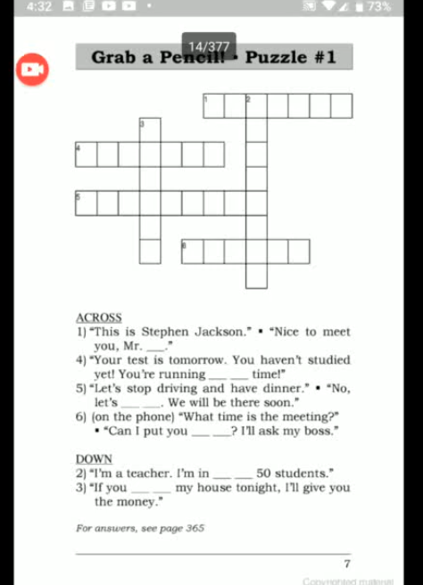
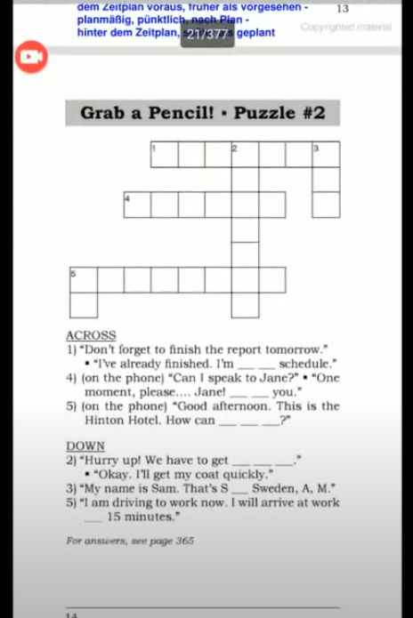
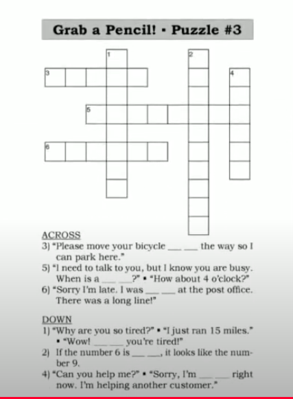

# Say It Better 
| Form | Word                | Meaning                | Example                |Reference                |
|---------------------|---------------------|---------------------|---------------------|---------------------|
| Keep + v-ing | Keep going | Continue ||[Youtube link](https://www.youtube.com/watch?v=nJkcOr-i9t0&list=PLjGyCF-b63jgheXXlZhfBIb2W65vktvOf&index=2s)|
|Mr. + second name |||||
  || drop by | visit for a short time အလည်လာ |eg. can i drop by your office later?   ||
|| hold on | ခဏ ကိုင်ထားပါ |||
|| can i put you on hold  | ဖုန်းခဏ ကိုင်ထားပါလို့ ပြောတာပဲ  ပိုယဉ်ကျေးတယ် |1) can i put you on hold for a minute ||
|| Someone's at my door | တံခါးခေါက်နေတယ် |||
|| in charge of | respoinsible for; supervisor of | eg:   1) in charge of customer service.   2) in charge of training new staff | NOTE: sometimes in charge of + v-ing |
||running short of time |deadline တခုနဲ့အတော် နီးကပ်နေတာကိုပြောချင်တာ |eg.   1) We're runnign short of time.   2) I have to work late tonight. I need to finish a project and I'm running short of time.   3) I'd like to finish this meeting soon. Let's move on to the next point because we're running short of time .||
||get a move on |မြန်မြန်လုပ် |eg.   1) We're late. Let's get a move on.   2) The movie is going to start soon. Let's get a move on or we'll be late.   3) We have to get a move on if we want to finish by Wednesday. ||
| that's -- for --- |||eg.   1) that's K for Korea||
||How can I help you ? or May I help you. || ||
||it's for you||eg.   1)   A: The phone is ringing.   B: I'll get it. I think it's for me.||
||i will get it/ I'll get it. |ငါဖွင့်လိုက်မယ်. ငါကိုင်လိုက်မယ်|||
||in an hour |----အတောအတွင်း|eg.   1) She hasn't arrived yet. She'll be here in 10 minutes.   2) He is almost finished with high school. He will graduate in a few months.||
||ahead of / on /behind schedule ||eg.   1) I'm ahead of schedule. I'm behind of schedule.   2) Please drive faster. We are behind schedule.   3)   A. How's the project coming along?   B. Fine. Everything is on schedule.|we can also use " ahead of time "|
||tied up|busy|eg.   1) I'm tied up right now. I can't talk.   2)   A: Can we meet today ?   B: Sorry, I'll be tied up all day . How about tomorrow?   3) I'm tied up now, but I'll be free in an hour. ||
||When is a good time ? |ဘယ်အချိန် ပြန်ခေါ်ပေးရမလဲ . ပြန်ချိန်ပြန်ခေါ်ရင်အဆင်ပြေမလဲ When is a convenient time for you |eg.   1) I have some papers for you to sign. When is a good time to drop by your office ? ||
||held up|တခုခုကြောင့်နှောင့်နှေးနေတာ. ကြန့်ကြာနေတ |eg.   1) I was held up at the airport for two hours!Customs Officials went through my bags.   2) I got home at 10 o'clock last night. I was held up at the office doing paperwork.   3) Sorry, I was held up at a meeting ||
||went through/go through|စေ့စေ့စပ်စပ်ရှာဖွေနေလိုပါ|||
|move [ something ] out of the way||တစုံတခကိုဖယ်တာပေါ့|eg.   1) Please move these boxes out of the way.   2) We're having a party. So I want to move the furniture out of the way.   3) There are a lot of things on your desk. if you move them out of the way . I'll put your computer there.||
||upside down/ right side up|ပြောင်းပြန် / အတည့်|eg.   1) The box is upside down! Please turn it right side up!   2) Look! That picture is upside down. You hung it the wrong way.   3) There's a cake in this box. Please make sure the box is right side up .||
||no wonder|အံ့သြစရာမရှိပါဘူး|eg.   1)  A. Why is he so sad?   B. His wife just died.   A. No wonder he's sad.   2)  A. This lamp doesn't work   B. You didn't plug it in.   A. No wonder it doesn't work.||
||||||
||||||
||||||

## Notice 
Sales Manager 
> Sales မှာ s ပါပါတယ်  

Furniture  
> uncountable . s / es ထည့်စရာမလိုပါဘူး 

## Puzzle 

