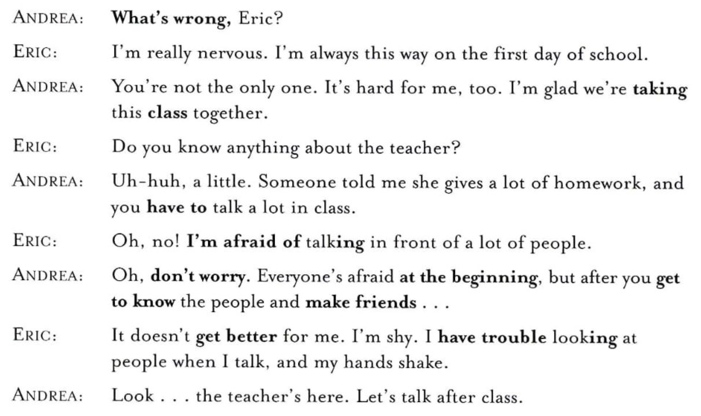
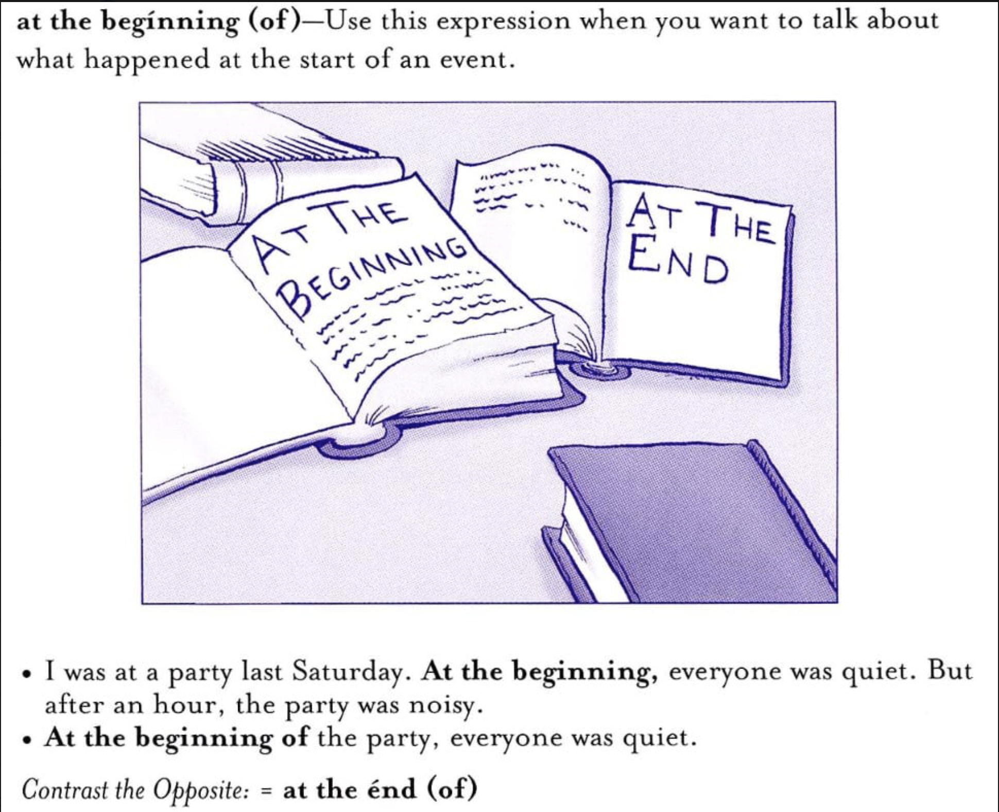
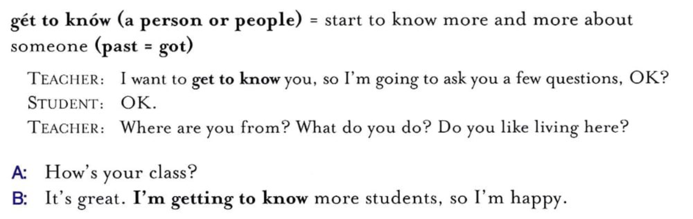

### Vocab
| Vocal | Meaning | Usage Example | Other 
|-------|-------|-------|-------
| on a daily basis | နေ့တိုင်း  | | This is my daily job / daily tasks 
| serene | အေးဆေး ဆိတ်ငြိမ်တာ | | 
| cozy corner | ဇိမ်ရှိတာ , အေးဆေး ထိုင်လို့ရတာ | | 
| enhance | ပိုကောင်းစေတာ | | 
| ambiance | ဒီဇီုင်းကာလာ အနေအထား | | 
| thrill | | | 
| fosters | | | 
| conquering| အောင်နိုင်တာ | | 
| captivated | နှိုးဆွ တာ interestingဖြစ်တာ  | | 
| crept | စိုးရိမ်စိတ်တွေက တဖြည်း၂ များလာတာ | | 
| adrenaline | စိတ်လှုပ်ရှားတဲ့ အခါ ဖြစ် လာတဲ့ အရာတွေ   | | 

### Speaking
Do you prefer to study at home or in a library?  
What is your favorite place to study?  
What part of your school do you like the most?  
What is your favorite subject?  
Do you prefer to work at home or in the workplace?  
Do you prefer to work alone or in a group?  

a class once you took => Speaking Title 1 

a time you were worried about / nervous / excited => Speaking Title 2

Library is not very fsamiliar to me .

When it comes to study space, I have mixed feelings about it. It depends on my mood.  
I prefer studying in a library due to its <b> serene environment </b>. Libraries provide a quiet atmosphere that minimizes distractions, allowing me to focus deeply on my work.   
The availability of resources, such as books and reference materials, further enhances my learning experience. 

My favorite place to study is a <b> cozy corner </b> of my local library. This space is not only quiet but also filled with natural light, creating an inviting atmosphere. Surrounded by shelves of books, I feel inspired and motivated to learn. The peaceful <b> ambiance </b> helps me concentrate better and absorb information more effectively than other locations.  
There is also a big window beside my table from which I can have fresh air. That also improves my concentration.

The part of my school I like the most is the canteen. It’s a lively place where students gather to eat and chat. The food is delicious, and there are many options to choose from. I enjoy spending time there with friends during lunch and sharing stories.

My favorite subject is math. I love solving problems and exploring numbers. Math challenges my mind and helps me think logically. It feels rewarding when I understand a difficult concept. Although some find it hard, I enjoy the thrill of working through equations and discovering solutions. It’s always exciting!

I prefer to work in the workplace because of its collaborative environment. Being surrounded by colleagues fosters a sense of teamwork and encourages brainstorming, which enhances creativity. Moreover, the structured setting of an office helps me maintain a clear boundary between work and personal life, ultimately contributing to higher productivity and focus.

I enjoy working in a group setting, as it promotes diverse perspectives and ideas. Collaborating with others allows for the exchange of knowledge and skills, leading to more innovative solutions. Additionally, the support and motivation from teammates can enhance productivity and make the work experience more enjoyable.

I recently participated in a management class that truly captivated my interest. The sessions provided valuable insights into effective leadership and organizational strategies. I found the discussions engaging and the content relevant, sparking my enthusiasm for further exploration in the field of management. It was an enriching experience overall.

It was a sunny afternoon, and I was about to give a presentation in front of a large audience. As I stood there, waiting for my turn, my heart raced, and nerves consumed me. Doubts crept into my mind, making me question my abilities. However, as I took a deep breath and stepped onto the stage, my fear transformed into determination. The adrenaline fueled my passion, and I delivered a successful presentation, conquering my fear and gaining newfound confidence.

### Listening 

What's wrong = What's the matter = What happen
take class အတန်းတက်တာ
I'm taking this class becuase it's very interesting
get to know သိလာတာ

at the beginning of ↔️ at the end of 
  
  
  
  
  
  

I'm trying my best in the current situation.
getting worse 
worse ~~ was 
