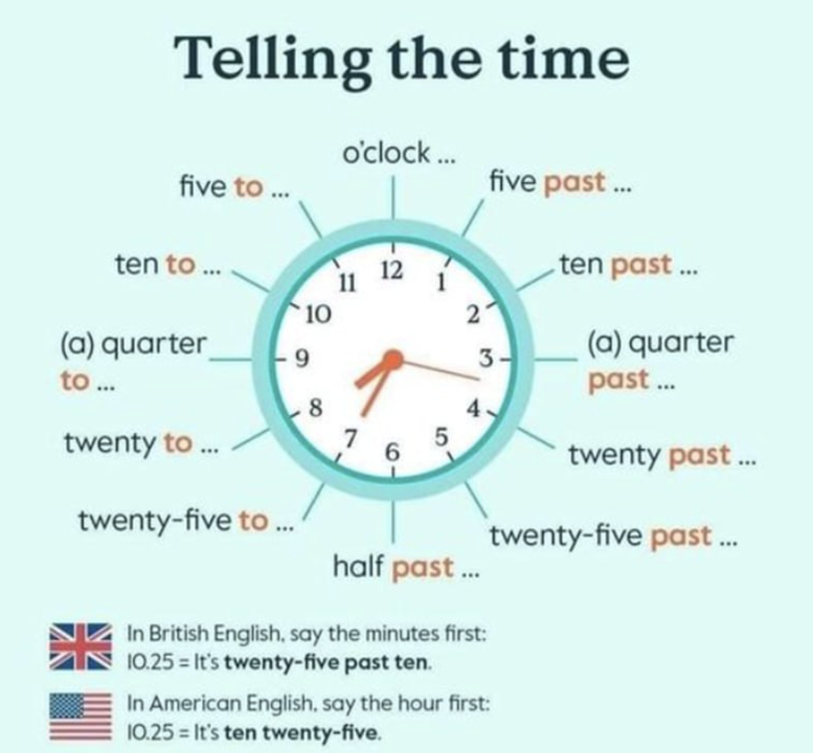
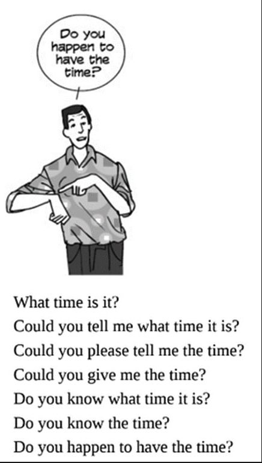
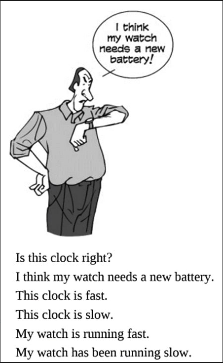
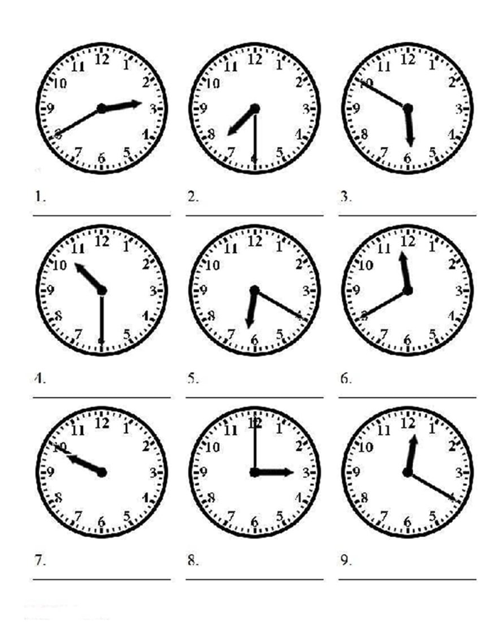
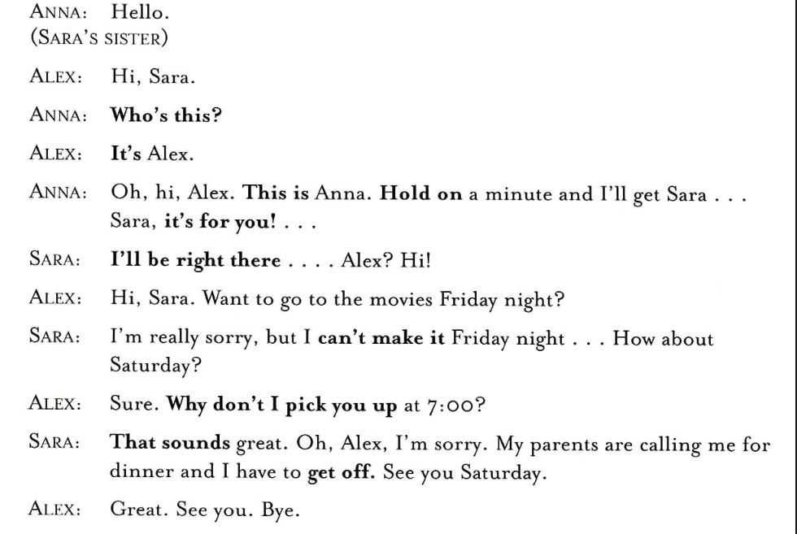

| Vocal | Meaning | Usage Example | Other 
|-------|-------|-------|-------
| ventilation | လေ၀င်လေထွက်ကောင်းတာ | | 
| nostalgic | | | 
| pang of nostalgia | | | 
| hand-me-down | တယောက်ယောက်ရဲ့ အကျကိုရတာ | |

### 
What time is it ? 
What's the time? 
do you have the time ? 

five past six = five after six
၆နာရီ၁၅ = quarter past six
၆နာရီခွဲဖို့၁၀မိနစ် = twenty past six 
၆နာရီခွဲဖို့၅မိနစ်။ = twenty-five past six 
၆နာရီခွဲ        = half past six 
၆နာရီခွဲပြီး ၅မိနစ် = twenty-five to seven 
၆နာရီခွဲပြီး ၁၀မိနစ် = twenty to seven
quarter to seven

What is Today Special ? 
What is it like ? ဒါဘယ်လိုလဲ ဆဆိုတာ မှာသုံး
What is the weather like today?  ကနေ့ ရာသီဉတူဘယ်လိုလဲ​
What is she like? 

What was your first mobile phone ? 
Will you buy a new one in the future ? 
tuition  
I feel nostalgic. I feel a pang of nostalgia.

It my memory servers me right, I was --- when  I got my first one. 
It was a hand-me-down one from my sister. အမကိုင်ပြီးသားဟာ ရတယ်

### Picture
  
  
  
 
   

I have been working here for 5 years. 
I have been waiting for 30 minutes.

နာရီ နှေးနေတယ် Clock is slow 
နာရီ က မြန် နေတာ Clock is fast 

Do you happen to have the time? ဘယ်နှနာရီ ရှိပြီးလဲ သိမလားနော်

[How to Order Food at a Restaurant in English](https://www.youtube.com/watch?v=uUMPULuwdLI) 

> I would like to order   
> I'll have = I will have   
> Could I have 
> Could I get 

[Speak English At The Restaurant!](https://www.youtube.com/watch?v=nI82Q35n8vQ)

> To eat out   = To dine out 
> Let's dine out tonight  
> To book => book a table   
>  Make a reservation   
> Reasonably priced     
> Attentive staff => staff who really care customer   
> Continental food = European food   
> Oriental food = Southeast Asian Food   
> Vegetarian food   
> Vegan food   
> work up an appetite   
> starter  
> Main course   
> dessert  
> side dishes  
> Allergen => The substances in the food that may cause an allergic reaction
> Make it 2 
> Flag down => to call the waiter / waitress   => Let's flag down the waiter 
> Round of drinks   => Can we get another round of drinks?
> Right away    
> Pay the bill = Foot the bill  
> Can i have the check please ? ( the bill/check)  
> Go Dutch => Share the cost 
> Cashier  