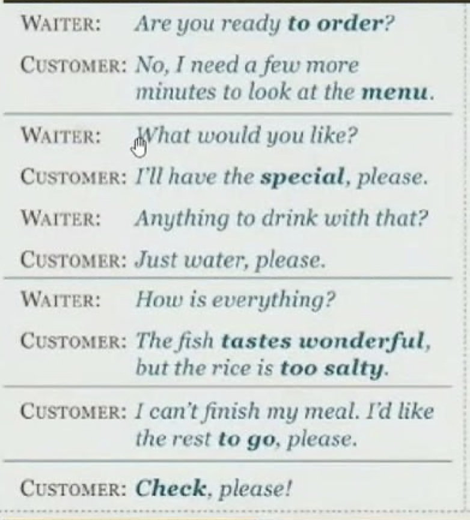

| Vocal | Meaning | Usage Example | Other 
|-------|-------|-------|-------
| Have some | ကိုယ့် သူငယ်ချင်းတယောက်ကို အမြည်း ကျွေးတာကို ပြောတဲ့အခါမှာ သုံးတာ | | 
| frugal | careful when using money or food, or (of a meal) cheap or small in amount:| a frugal lifestyle, a frugal meal of bread and soup | 
| thrifty | ချွေတာ showing a careful use of money, especially by avoiding waste | They have plenty of money now, but they still tend to be thrifty. | 
| economical | using as little of something as possible; wasting nothing or very little | | 
| stingy | unwilling to spend money | | 
| tolerant | willing to accept behaviour and beliefs that are different from your own, although you might not agree with or approve of them | They are very tolerant of different religions in that country | 
| passionate | having very strong feelings or emotions | Joe is passionate about baseball | 
| ambitious | having a strong wish to be successful, powerful, or rich | He's very ambitious for his children | 
| integrity | the quality of being honest and having strong moral principles that you refuse to change |  No one doubted that the president was a man of the highest integrity | 
| curious | စူးစမ်းလိုစိတ် interested in learning about people or things around you |  was curious to know what would happen next| 
| inquisitive | wanting to discover as much as you can about things, sometimes in a way that annoys people | | 
| nosy | too interested in what other people are doing and wanting to discover too much about them | She was complaining about her nosy parents   A rather nosey woman once asked him about his personal life.
| 
| | | | 
| | | | 

### Speaking
1. What are the most popular dishes on your menu ? 
2. Can you recommend something that's unique to this restaurant? 
3. Do you have any vegetarian or vegan options available?
4. How spicy is the dish you're suggesting? 
5. Are there any seasonal specialties I should try ? 
6. What dessert do you think pairs well with my meal ? 

### Picture
  
  
  
 
   
 
1. post office 
2. car park 
3. petrol station 
4. cinema 
5. stadium 
6. zoo 
7. airport 
8. hospital 

### Listening 
 

### Other Note 

[Not Afraid to Ask for Directions | Brain Games](https://www.youtube.com/watch?v=5Ikl_1f-aYQ)  
> Could you tell me where is ...?   
> How do i get .. ?   
> What's the best way to .. ?   
> Go straight on   
> Go along this street   
> on the right , turn right, on the left 
> The first street on the right, The second street on the right
> go across the street, go through the park

[Asking and giving directions. Learn English](https://www.youtube.com/watch?v=NvMbJjpF-94)

He has -----  
> He has a good heart.    
> He has a kind heart.  
> He has an open mind.   

Hyphened words
> He is good-hearted.  
> He is kind-hearted.  
> He is open-minded.  
> He is narrow-minded.  
> He is close-fisted. ကပ်စည်းနည်းတာ -- stingy  

> Tight-fisted ကပ်စည်းနည်းတာ။ 
> frugal  / thrifty / economical   ချွေတာ    
> generous     
> mean     
> impatient     
> patient / tolerant      
> greedy     
> aggressive   ရန်လိုတာ    
> passionate / ambitious   ရည်မှန်းချက်ကြီးမာသော။  
> He is short-tempered.   စိတ်တိုလွယ်တာ   
> He is long-winded. / talkative. / a chatter-box.  စကားများတာ လေအိုးတာ။။ 
> curious --- inquisitive -- nosy စပ်စုတာ   
> He is quiet / a man of few words. / introverted.     
> He is a man of his word.  
> Be a man of your word.  
> He is a man of character. သိကခာရွိသူ / ေျဖာင့္မတ္တည္ၾကည္သူ     
> He is a man of integrity.     
> He is a man of many talents.    
> He is moody and unpredictable.  moody စိတ်ခံစားချက်   
> He is naïve တုံးအတာ and gullible အယုံလွယ်တာ .    

> on your left . on your right 
